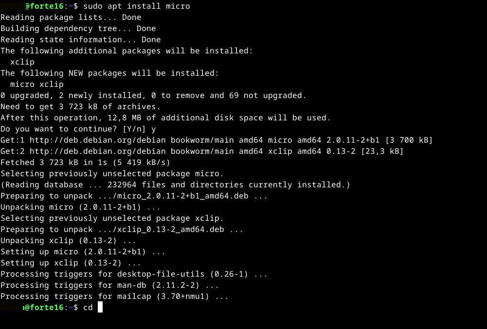

Kurssi Linux-palvelimet, syksy 2024. Tehtävä h2 kuningaspingviini.

### x) Tiivistelmä tekstistä "Command Line Basics Revisited", https://terokarvinen.com/2020/command-line-basics-revisited/

- Komentoriviä on käytetty jo ennen internetiä. Se on kätevä ja nopea, ja se voidaan helposti automatisoida.
- Komentorivillä ollaan aina jossakin kansiossa, ja kansioiden välillä siirrytään komennoilla *cd kansionnimi* ja takaisin ylempään kansioon *cd ..*.
- Komennot suoritetaan heti, eikä käyttäjältä kysytä, haluaako hän varmasti esimerkiksi poistaa tiedoston.
- Peruskomentoja ovat mm. *cp* (kopioi), *rm* (poista) ja *mv* (siirrä tai nimeä uudelleen). Komennoista löytää tietoa esimerkiksi komennoilla *man komento* ja *komento --help*.
- Tabulaattorilla voi täydentää komennon loppuosan, ja ylös- ja alaspäin-nuolilla voi selata käyttämiään komentoja.
- Kun halutaan tehdä asennuksia tai muita ylempiä käyttöoikeuksia vaativia toimenpiteitä, komento aloitetaan termillä *sudo*, esimerkiksi *sudo apt-get update*.

  ### a) Micron asennus
Koneessa on asennettuna virtuaalikone, jossa Linux (Debian 12) pyörii. Komentoja käytetään Terminal emulator -ohjelmassa. Asensin micro-editorin komennolla *sudo apt install micro*

   

Editori aukaistaan komennolla *micro tiedostonnimi*. Jos tiedostoa ei ole, se luodaan ja aukaistaan.
  

  ### b) Kolme komentoriviohjelmaa
  Tehtävänä oli asentaa kolme komentoriviohjelmaa. Googlella löysin listauksia, joista valitsin ohjelmat.
  
 Ddgr (https://github.com/jarun/ddgr) on ohjelma, jolla voi hakea internetistä DuckDuckGo-haulla, eli samantyyppisellä kuin Google, mutta DuckDuckGo kunnioittaa käyttäjien yksityisyyttä. (Se on myös vähän huonompi kuin Google, mutta silti käytän sitä pelkästään periaatteesta.)  Aikaisemmissa kokeiluissani olin asentanut Snap-paketinhallintaohjelman, joten pystyin asentamaan Ddgrn komennolla *sudo snap install ddgr* . 
 

Mutta kun kokeilin tehdä nettihaun, niin sain ilmoituksen *bash: ddgr: command not found*. Kysyin ChatGTP:ltä miksi näin kävi. Sen avulla löysin syyn, eli Snap ei ollut PATH-muuttujassa. Tein sitten seuraavat komennot ChatGPT:n ohjeen mukaan, eli lisäsin Snapin PATH-muuttujaan ja lisäksi poistin ja asensin Snapin uudelleen. Ohjelma alkoikin sen jälkeen toimia, eli komennolla *ddgr hello world* ohjelma haki internetistä sivustoja.

  
  
  Hakuihin voi lisätä erilaisia parametrejä, esimerkiksi hakea tietyllä kielellä. 
  
  
  

  Hakutulokset ovat kyllä aika erikoisia, sillä esimerkiksi Wikipedia tulee yleensä aina ensimmäiseksi, mutta näissä hauissa se ei aina tullut. Lisäksi hakutuloksen perässä olevaa url-linkkiä ei pysty klikkaamaan, ellei siinä ole "www".
   
   
#### Exiftool
Exiftool (https://exiftool.org/) on työkalu, jolla voi katsoa ja muokata valokuvien metatietoja. Sillä voi esimerkiksi poistaa metatiedoista sellaisia tietoja, joiden ei halua näkyvän kaikille kuvan katsojille, kuten paikkatiedot. 

Exiftoolin asentaminen olikin aika erilainen kuin ddgr-ohjelman. Exiftool.org-sivuston ohjeiden mukaan latasin tiedoston https://exiftool.org/Image-ExifTool-12.96.tar.gz Downloads-kansiooni.  Sitten sivuston https://exiftool.org/install.html mukaisesti (kohdasta Unix Platforms) menin Downloads-kansioon, ja siellä suoritin komennon *gzip -dc Image-ExifTool-12.96.tar.gz | tar -xf -*, ja sen jälkeen siirryin kansioon "Image-ExifTool-12.96". Sen jälkeen suoritin komennot *pearl Makefile.PL*, *make test* ja *sudo make install*. 

Hain Wikimedia Commonsista jonkun satunnaisen kuvan, jonka latasin ja siirsin kyseiseen "Image-ExifTool-12.96.tar.gz"-kansioon. 
Nyt komennolla *./exiftool tiedostonnimi* sain näkyviin kyseisen kuvan exif-tiedot.
  

Komennolla *./exiftool -s tiedostonnimi* näkee tietojen tagit.

Komennolla *./exiftool -all= tiedostonnimi* kaikki exif-tiedostot poistettiin, ja jäljelle jäi vain ilmeisesti käyttöjärjestelmän tiedot, kuten viimeinen muokkausajankohta jne.

#### Cool retro terminal
Viimeinen koettamani komentoriviohjelma onkin vähän erilainen. Se vaikutti niin hupaisalta, että oli pakko kokeilla. Cool retro terminal (https://github.com/Swordfish90/cool-retro-term) näyttää vanhalta kuvaputkinäytöltä, jossa jopa menee vaakasuorassa "viiva" ylhäältä alas.  

En tiedä, onko sen käyttämisessä oikein ideaa, muuta kuin leikkiä sillä vähän aikaa. Se kuitenkin vie muistiakin enemmän, kuin tavallinen komentorivi. 

  ### c) Tärkeät kansiot
Juurikansioon pääsee komennolla *cd ..*.

   

Juurikansion (sisällön näkee komennolla *ls*
    

 Home-kansiossa on kaikki käyttäjien kansiot. Koska omassa koneessani on vain yksi käyttäjä, niin alikansioita on yksi.
 

Downloads-kansiossa näkyy käyttäjän sinne lataamat tiedostot.
  

Etc-kansiossa on erilaisia konfiguraatiotiedostoja.
  

Hosts-tiedosto.

  

  Media-kansiossa näkyisi esimerkiksi USB-tikku tai koneen liitetty ulkoinen kovalevy, mutta nyt se on tyhjä.
    

/var/log-kansiossa on erilaisia lokeja.
   

Tiedostossa wtmp on dataa sisään- ja uloskirjautumisista. (Lähde: https://linuxhandbook.com/utmp-wtmp-btmp/) Loki on kyllä aika vaikeaselkoinen.
  

   ### d) Grep-komento
   Grep-komennolla voi etsiä tekstiä tiedostoista. Se näyttää tuloksena ne rivit, joilta teksti löytyy. (Lähde: https://linuxize.com/post/how-to-use-grep-command-to-search-files-in-linux/)

   Yksinkertainen esimerkki: *$ grep texti /hakemisto/tiedosto*. Jos haettavassa stringissä on välilyöntejä, string pitää laittaa lainausmerkkien sisään.

   Grep löytää haetun stringin kaikki ilmentymät, myös sellaiset, joissa string on jonkin sanan sisällä. Jos halutaan etsiä vain kokonaisia sanoja, niin voidaan käyttää komentoa *$ grep teksti -w string /dir/tiedosto*.

   Grepillä voidaan myös tulostaa riviä ennen tai jälkeen haettua stringiä. Jos halutaan tulostaa vaikkapa tietyn nimen jälkeen tulevia rivejä, voidaan käyttää komentoa *$ grep - B jussi /dir/tiedosto*, joka tulostaa viisi riviä haetun stringin jälkeen.
   
   Alla esimerkissä on haettu sanalla "Delightful", ja ohjelma tulosta rivin siitä alkaen.
     

  ### e) Pipe
  Pipe-komennolla voidaan yhden komennon tulos antaa toisen komennon käsiteltäväksi. Niitä voidaan laittaa myös useampi peräkkäin.
  Esimerkiksi jos tiedostossa on nimilista, jossa saattaa tuplia, voidaan lista ensin saattaa aakkorjärjestykseen ja sitten poistaa peräkkäiset tuplat komennolla *sort nimilista.txt | uniq*.

  ### f) Rauta
  Yritin listata koneen raudan komennolla *sudo lshw -short -sanitize*, mutta sain ilmoituksen "lshw: command not found". Installoin lshw:n komennolla *sudo apt-get install lshw*. Sen jälkeen listauskomento onnistui.
   

Tiedoista näkyy, että kyseessä on virtuaalikone (VirtualBox). En tiedä mitä ensimmäinen BIOS memory tarkoittaa, mutta 2Gib System memory in ilmeisesti itse asettamani kahden gigan RAM-muisti, jonka allokoin virtuaalikoneen asennuksessa. Tiedoista näkyy myös fyysisen tietokoneen prosessori eli 11th Gen Intel i5. Voisin kuvitella, että ne tiedot, jotka ovat dev-hakemistossa, ovat virtuaalikoneen tietoja. Esimerkiksi /dev/cdrom-hakemistossa on CD-ROM, jota ei fyysisessä koneessa ole. Toisaalta usb1 ja usb2, jotka eivät ole hakemistossa dev, voisivat olla fyysisen koneen USB-portit. Kohdassa /dev/sda näkyy virtuaalikoneen "kovalevy", jonka kokonaiskoko on 64GB. Asennuksessa allokoin virtuaalikoneelle 60 GB. Kovalevy on jaettu kahteen osaan eli sda1 ja sda2, joista sda2 sisältää Linuxin, noin neljä gigatavua. 

   
