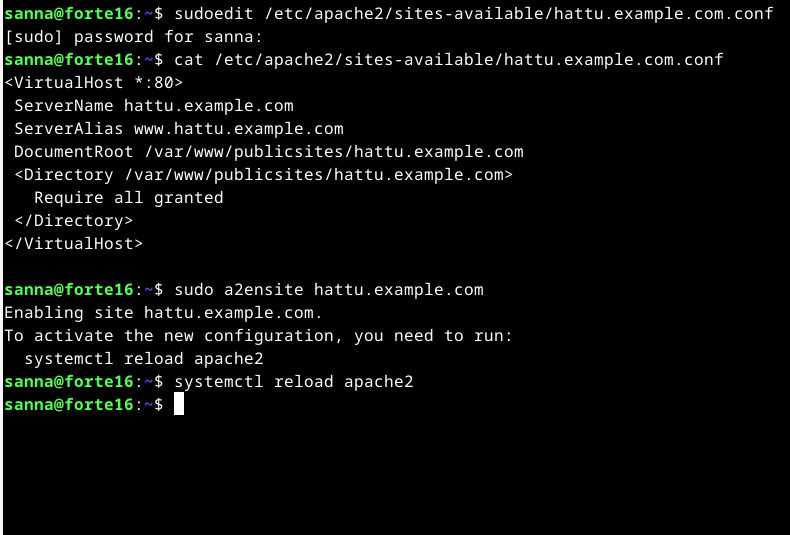
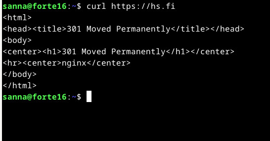

## Linux-palvelimet, syksy 2024. Tehtävä h3: Hello Web Server

### x) Tiivistelmä tekstistä "Name-based Virtual Host Support", Apache documentation https://httpd.apache.org/docs/2.4/vhosts/name-based.html

- IP:hen perustuvassa virtuaalipalvelimessa jokaisella hostilla täytyy olla oma IP-osoite.
- Nimipohjaisten virtuaalipalvelinten avulla voi yhdellä IP-osoitteella olla monta eri hostia.
- DNS-palvelin mappaa host-nimet oikeaan IP-osoitteeseen, ja Apachen HTTP-palvelin konfiguroidaan tunnistamaan hostien nimet.
- Asetuksissa määritellään \<VirtualHost\>-lohkojen sisään vähintäänkin palvelimen nimi (ServerName), mahdolliset aliakset (ServerAlias) ja kansio, jossa kyseisen hostin sisältö löytyy (DocumentRoot).
- Server-aliaksilla voidaan ohjata liikenne vähän erilaisilla osoitteilla samaan palvelimeen, esimerkiksi hs.fi ja www\.hs\.fi tai firmannimi.com ja firmannimi.org.

### Tiivistelmä tekstistä "Name Based Virtual Hosts on Apache – Multiple Websites to Single IP Address", Tero Karvinen, 10.4.2018, https://terokarvinen.com/2018/04/10/name-based-virtual-hosts-on-apache-multiple-websites-to-single-ip-address/

Lyhyt ohje nimipohjaisen palvelimen asentamiseksi ja testaamiseksi.

- Asenna palvelin (sudo -apt-get -y install apache2).
- Lisää virtuaalipalvelin lisäämällä konfiguraatiotiedosto, jossa on palvelimen tiedot <VirtualHost>-lohkon sisällä.
- Ota konfiguraatio käyttöön (restart a2ensite 'konfiguraatiotiedosto') ja uudelleenkäynnistä palvelin (sudo systemctl restart apache2).
- Luo nettisivu normaalina käyttäjänä ja testaa se curl-komennolla (curl -H 'Host: esimerkki.com' localhost').
- Simuloi nimipalvelinta muokkaamalla -hosts-tiedostoa ja lisää sinne esimerkiksi 127.0.0.1. localhost ja 127.0.0.1. "esimerkki.com, ja nyt voit kokeilla osoitetta http://localhost selaimella. Jos näet eri sivut, olet onnistuneesti asentanut kaksi virtuaalipalvelinta.

## a) Apache-palvelimen asesnnus ja testaus
Avasin Linuxin virtuaalikoneessa, kirjauduin sisään, avasin Terminal emulator -ohjelman ja tein päivityksen *sudo apt-get update* -komennolla.

Olin asentanut Apache2-palvelminen luennolla *sudo apt-get install apache2* -komennolla.

Kokeilin mitä tapahtuu, jos kirjoitan "localhost" selaimen osoiteriville. Ruudulle ilmestyi Apachen Debian oletussivu. Ilmeisesti siis palvelin pyöri.
 
 

 Kokeilin hakea localhostin myös komentorivillä curl-komennolla. Ilman mitään paramatrejä curl-hakee sivun sisällön ja printtaa sen komentokehotteeseen. (Lähde: https://www.baeldung.com/linux/curl-guide)

  
 *curl localhost | less * -komento printtasi ruudulle ensimmäisen sivun Apache2-oletussivun html-dokumentista.

Apache2-palvelinta hallinnoidaan systemctl-komennolla, joten kokeilin sulkea palvelimen ja kokeilla uudelleen localhostia. (Muita Apache- tai järjestelmäversioita saatetaan hallinnoida muunlaisilla komennoilla. Lähde: https://www.digitalocean.com/community/tutorials/how-to-install-the-apache-web-server-on-debian-11.)

`sudo systemctl stop apache2`
  

Kun palvelin oli pysäytetty, localhostia ei löytynyt, ja uudelleenkäynnistyksen jälkeen curl-komento tulosti sen html-sisällön taas ruudulle.

Kokeillessani palvelimen pysäyttämistä ja uudelleenkäynnistämistä huomasin, että jos laitoin systemctl-komennon ilman sudoa, sain eteeni popup-ikkunan, johon minun tuli laittaa salasana, mutta jos aloitin komennon "sudo systemctl", niin minun ei tarvinnut laittaa salasanaa ollenkaan. Pikainen kysymys ChatGTP:ltä ja sen jälkeinen nettihaku kertoivat, että järjestelmä muistaa salasanan jonkin aikaa, asetuksista riippuen esim. 5-15 minuuttia, ettei sitä tarvitse laittaa jokaisen sudo-komennon jälkeen, jos niitä tekee useita pienen ajan sisällä. (Lähde: https://man7.org/linux/man-pages/man8/sudo.8.html)

## b) Lokimerkinnät sivun lataamisesta

Tehtävänä oli analysoida lokimerkintöjä, jotka syntyvät kun palvelimelta haetaan nettisivu.

Lueskelin tiedostoa /etc/apache2/apache2.conf ja opin siitä, että systemctl-komennonn sijaan Debianissa voisi käyttää komentoa apache2ctl, esim. apache2ctl stop ja apache2ctl start. Nuo komennot eivät kuitenkaan vaikuttaneet toimivan, joten jatkoin systemctl-komennon käyttöä.

Hain taas html-sivun localhostista curl-komennolla ja katsoin sitten komennolla "sudo tail /var/log/apache2/access.log" kymmenen viimeistä merkintää kyseistä lokista. (Tail-komennosta: https://www.howtogeek.com/481766/how-to-use-the-tail-command-on-linux/) 

  

 Access-lokissa näkyy useita kokeiluja curl-toiminnon käytöstä.

Yritin mennä /var/log/apache2-kansioon katsomaan mitä siitä löytyy, mutta en päässyt kansioon. ChatGPT neuvoi käyttämään komentoa "sudo su", jolloin käyttäjänimeni muuttui "rootiksi". Root-käyttäjällä pääsin apache2-lokikansioon, ja näin että siellä on lokit access.log, error.log ja otherv_hosts_access.log. "Exit"-komennolla pääsin takaisin omaan käyttäjänimeeni. Sudo su -komennosta on lisätietoa sivulla  https://linuxize.com/post/su-command-in-linux/, mutta en jaksanut siihen kummemmin paneutua. Ihmettelin vain, miksi en päässyt tiettyyn kansioon, vaikka minulla on sudo-oikeudet.

Lokin tulkitsemisessa on käytetty lähteenä https://httpd.apache.org/docs/current/logs.html ja muut lähteet mainittu erikseen. 

- 127.0.0.1 : Pyynnön tehneen koneen IP-osoite, eli tässä tapauksessa kotiverkkoni sisäinen osoite.

- "-" Ensimmäinen viiva (hyphen) viittaa asiakaskoneen (client) RFC 1413 -identiteettiin, jota siis tässä lokissa ei tiedetä. Apachen dokumentaation mukaan tämä tieto on hyvin epäluotettava, eikä se ole oletuksena käytössä. Lisätietoa RFC 1413 identiteetistä: https://datatracker.ietf.org/doc/html/rfc1413.

- Aikaformaatti päivä/kuukausi/vuosi:hh:mm:ss ja lopuksi aikavyöhyke UTC:hen verrattuna.

- "GET / HTTP/1.1" tarkoittaa, että asiakaskone teki GET-pyynnön palvelimelle ja käytti HTTP 1.1 -protokollaa. On olemassa myös uudemmat HTTP 2 ja HTTP 3 -protokollat (sekä vanhempi 1.0). Lähde: https://http.dev/1.1

- 200: Numerokoodi, joka kertoo pyynnön onnistumisesta. Kakkosella alkavat ovat onnistuneita, kolmosella alkavat ohjauksia eteenpäin ja nelosella alkavat virheilmoituksia palvelimelta. (Koodeista: https://cwiki.apache.org/confluence/display/HTTPD/CommonHTTPStatusCodes) 

- 10956: Haetun sisällön koko (ilmeisesti tavuina)

-  "-" Tässä kohdassa on referer eli se sivu, jossa pyynnön tekijä oli kun lähetti pyynnön palvelimelle. Koska tässä tapauksessa tein curl-komennon komentoriviltä, enkä klikkailut mitään linkkejä selaimessa, on tämä kohta tyhjä.

- "curl/7.8.8.1" Tieto, jonka selain lähettää palvelimelle itsestään eli user-agent header. Koska kyseessä ei ollut selaimella tehty pyyntö vaan curl-komento, niin pyysin ChatGPT:tä selittämään mitä tässä kohtaa näkyy. ChatGPT kertoi, että curl-komento lähettää mainitun tiedon itsestään, mutta että sitä voi itse myös muuttaa. Kokeilinkin ChatGPT:n neuvomalla komennolla "curl -A "MyCustomUserAgent/1.0" localhost, eli lähetin palvelimelle  taas pyynnön hakea nettisivu, ja sen jälkeen katsoin access.log-tiedostoon, jossa näkyi kyseinen merkintä. 

 

## c) Etusivu uusiksi. Uuden virtuaalipalvelimen teko

Lähde (ohjesivu): https://terokarvinen.com/2018/04/10/name-based-virtual-hosts-on-apache-multiple-websites-to-single-ip-address/,  muut lähteet mainittu erikseen.

Ohjesivun mukaisesti suoritin komennon `echo "Default"|sudo tee /var/www/html/index.html`

Tee-komento lisää echo "Default" -komennon tuloksen kyseiseen tiedostoon eli index.html-sivuun. (Lisäksi se tulostuu komentorivi-ikkunaan normaalisti echo-komennon mukaisesti.) Lähde: https://linuxconfig.org/tee

Tämän jälkeen tein komennon "curl localhost", ja aikaisemman apache2-oletussivun sijaan näin tekstin "Default".  
 

Tarkistin myös selaimella, että siellä näkyy sama:

Kävin vielä katsomassa var/www/html-kansiossa, että siellä kyseinen index.html-tiedosto on ja sen sisältö tosiaan on pelkkä "Default"

 

Vaihdoin sudo su -komennolla root-käyttäjäksi, jotta pääsin apache2-kansioon ja siellä sites-available-alikansioon. Kansiossa oli kaksi tiedostoa: 000-default.conf ja default-ssl.conf. 000-default.conf on Apachen oletussivun virtuaalipalvelin-tiedot.

Tiedostossa on pelkästään ServerAdmin, DocumentRoot ja lokien sijaintitiedot.
 

default-ssl.conf-tiedostoa lukemalla ja vähän googlaamalla ymmärsin, että SSL liittyy sertifikaatteihin (Secure Sockets Layer), joiden avulla sivusto voi todistaa jonkin kolmannen osapuolen avulla, että yhteys on turvallinen (esim. pankit).

En täysin ymmärrä, mitä tehtävässä pitää tehdä, joten hyppäsin kohtaan, jossa tehdään sivu "hattu.example.com". Sivun nimen tulee näkyä asetustiedoston nimessä ja ServerName-muttuujassa sekä etusivun sisällössä. Sille pitää siis tehdä uusi virtual host. Koska en pääse apache2-kansioon suoraan, niin käytän sudo-oikeuksia muokatakseni/luodakseni sinne tiedoston hattu.example.com.conf": sudoedit /etc/apache2/sites-available/hattu.example.com.conf"

 

Sen jälkeen enabloin virtuaalipalvelimen komennolla `sudo a2ensite hattu.example.com` ja uudelleenkäynnistin palvelimen komennolla `sudo systemctl restart apache`. Tai itse asiassa käytiin komentoa `systemctl reload apache2`, koska komentokehote niin kehotti tekemään.

Sitten loin hattu.example.com-hakemiston komennolla `mkdir -p /var/www/publicsites/hattu.example.com/` ja kirjoitin index.html-sivulle tekstin "hattu" komennolla `echo pyora > /var/www/publicsites/hattu.example.com/index.html`.

 
-p tekee tarvittavat yläkansiot, jos niitä ei vielä ollut olemassa. Jouduin käyttämään sudo-oikeuksia kansion luomisessa, ja tässä vaiheessa muistin, että kyseinen kohta piti tehdä tavallisena käyttäjänä. Niinpä poitin juuri tekemäni kansion (sudo rmdir...) Kävin katsomassa, että www-kansiossa ei ollut enää publicsites-kansiota, mutta tietenkin se oli, koska olin vain poistanut sen sisältämän alikansion, joten poistin sitten myös publicsites-kansion.

Tässä vaiheessa olin jo niin pyörällä päästäni, että katsoin parhaaksi aloittaa tehtävä uudelleen.

Eli, tehtävänä oli tehdä uusi "name based virtual host", ja sivun tulee näkyä suoraan palvelimen etusivulla http://localhost". Sivua pitää myös pystyä muokkaamaan normaalina käyttäjänä. 

Laitoin siis palvelimen päälle jos se ei jo ollut (sudo systemctl start apache2) ja kokeilin, mitä tulee kun kirjoitan "curl localhost". Ruudulle tulostuu "Default". Tämä siis tulostuu tiedostosta /var/www/html/index.html, ja varmistan sen vielä komennolla "sudo cat /var/www/html/index.html". 

Olin siis korvannut apachen oletus-index.html-sivun sisällön tekstillä "Default". 

Luen tehtävänantoa kymmenettä kertaa ja kyselen ChatGPT:ltä tyhmiä ja vielä tyhmempiä kysymyksiä, ja alan ehkä vihdoin ymmärtää mitä minun pitäisi tehdä. Pitäisi siis tehdä "etusivu" uusiksi, eli poistaa vanha etusivu ja korvata se hattu.example.com-sivulla niin, että kun menee osoitteeseen "localhost", niin sieltä putkahtaa esiin hattu. Kai.

Löysin sivuston jonka ohjeet näyttävät lupaavilta (ainakin kun selasin ohjeen kahdessa sekunnissa läpi). https://reintech.io/blog/configuring-apache-virtual-hosts-debian-12

Sivuston ohjeen kohdasta Step 2: 

Tehdään hakemistot tai tässä tapauksessa yksi hakemisto, koska sivuja on vain yksi.

`sudo mkdir -p /var/www/hattu.example.com/public_html`

Tarkistin ls -komennolla, että kyseinen hakemisto tosiaan on nyt olemassa.

Oliko minun pakko käyttää "sudo mkdir" -komentoa voi olisiko ilman sudoa kelvannut? Poistin sekä public_html että hattu.example.com-kansiot.

Loin ne uudelleen ilman sudoa:
`mkdir -p /var/www/hattu.example.com/public_html`

Tulos: Permission denied.

Palasin nettisivun ohjeisiin ja tein kansion uudelleen sudo-oikeuksilla.

Sitten vaihdoin kansion omistajaksi itseni (koska omistajana oli root): 

`sudo chown -R $sanna:sanna /var/www/hattu.example.com/public_html`

Ohjeessa kehotetaan tekemään myös "suco chmod -R 755 /var/ww, jotta sivulle pääsisi kuka vaan, mutta en tee sitä, koska ei sivulle pääse mistään ulkopäin.

Sitteen teen yksinkertaisen index.html-sivun 

`echo '<html><body><h1>Hattu!</h1></body></html>' |  tee /var/www/hattu.example.com/public_html/index.html`

En pystynyt sitäkään tekemään ilman sudo-oikeuksia. Muutin siis itseni public_html-kansion omistajaksi

`sudo chown sanna:sanna /var/www/hattu.example.com/public_html`

Seuraavaksi muokkasin virtuaali hostin konfiguraatio-tiedostoa.

`sudo micro /etc/apache2/sites-available/hattu.example.com.conf`

Sieltä löytyi edellisen yritykseni DocumentRoot eli /var/www/publicsites/hattu.example.com, joten muutin siihen /var/www/hattu.example.com/public_html

 

Seuraavaksi suoritin komennon

`sudo a2ensite hattu.example.com.conf`

Sain ilmoituksen, että "Site hattu.example.com already enabled".

Kokeilin onko konfiguraatiotiedoston syntaksi kunnossa komennolla 

`sudo apache2ctl configtest`

 

Disabloin apache-palveminen oletussivun:

`sudo a2dissite 000-default.conf`

ja sen jälkeen starttasin palvelimen uudelleenn

`sudo systemctl reload apache2`

Kokeilin nyt komennolla "curl localhost" ja sain tulokseksi "hattu".

 

Samoin, kun menin selaimella osoitteeseen "localhost", niin näin siellä tekstin "hattu". Nyt siis näyttäisi olevan niin, että hattu.example.com ja siellä public_html-kansiossa oleva index.html on korvannut apachen oletussivun. En vain ihan ymmärrä, miten se tapahtuu, koska en mielestäni koskenut mihinkään "localhost-juttuun". 

## e) Tee validi HTML-sivu

Kopion mallin sivulta https://terokarvinen.com/2012/short-html5-page/ , eli avasin index.html-sivun micro-editorissa

`micro /var/www/hattu.example.com/public_html/index.html`

 

Sivun näkymä selaimessa:
 

W3validator valitti yhdestä tagista ja ohjeisti lisäämään kielen, joten poistin yhden tagin sulkumerkin ja lisäsin kieleksi html lang=fi", minkä jälkeen validaattori ei enää antanut varoituksia tai ilmoituksia.

 

 
*Muutosten jälkeen validator ei enää valittanut*

## f) Curl ja curl -I -komennot
Kun curl-komentoa käytetään ilman parametrejä esimerkiksi html-päätteisen tiedoston hakemiseen, niin se hakee ja tulostaa tiedoston oletuksena komentoriville. 

 
*hs.fi vastaa curl-toimintoon 301-vastauksella, eli sivusto löytyy jostain muualta*

 
*curl -I -komennolla näkyy enemmän*

curl https://www.hs.fi | less -komennolla tulostuu nettisivun html-tiedoston sivu
 

 
curl -I https://www.hs.fi 

Aluksi näkyy HTTP/2 200, eli Http-protokollan versio 2, ja sen jälkeen näkyy koodi 200, eli "Ok". 

Content-type: Haetun sisällön formaatti, tällä kertaa text/html. 
Content-length: Haetun sisällön koko.
Server: Pyynnön vastaanottama palvelin. Tässä ei kannata olla paljoa tietoa tietoturvasyistä.  https://developer.mozilla.org/en-US/docs/Web/HTTP/Headers/Server 
etag: Tunniste sisällön tietylle versiolle. Jos versio muuttuu, myös tunniste muuttuu. Näin palvelimen ei tarvitse lähettää uutta versiota, jos versio ei ole muuttunut. https://developer.mozilla.org/en-US/docs/Web/HTTP/Headers/ETag
x-amz-cf-pop: Amazonin hostaukseen liittyvä https://docs.aws.amazon.com/AmazonCloudFront/latest/DeveloperGuide/understanding-response-headers-policies.html

