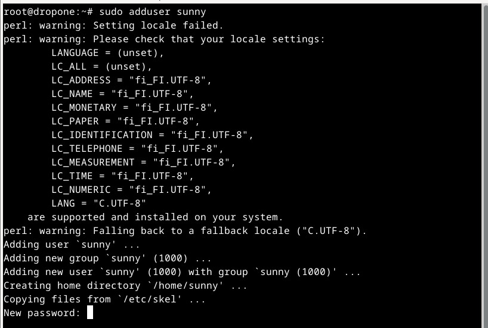
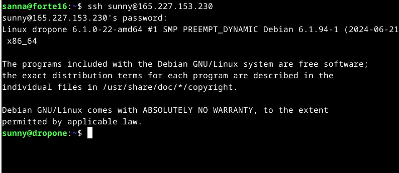

# Linux-palvelimet, syksy 2024. Tehtävä h4: Maailma kuulee

### x) Tiivistelmä: Teoriasta käytäntöön pilvipalvelimen avulla (h4), Susanna Lehto, 14.2.2022 https://susannalehto.fi/2022/teoriasta-kaytantoon-pilvipalvelimen-avulla-h4/

a) Pilvipalvelimen vuokraus ja asennus
- Ohjeet DigitalOceanille ja Namecheapille, jotka saatu GitHub Education-paketin kautta
- palvelin EU:sta GDPR:n takia
- DigitalOceanin virtuaalipalvelimen IP-osoite lisätään Namecheapin hallintapaneelissa

d) Palvelin suojaan palomuurilla 
- ssh-yhteys virtuaalipalvelimeen, salasana DigitalOceanissa asetettu salasana
- päivitys, palomuurin asennus, reikä palomuuriin ja palomuuri päälle

e) Kotisivut palvelimelle
- tehdään uusi käyttäjä, jolle annetaan sudo-oikeudet
- root-käyttäjän lukitus 
- Apache-webbipalvelimen asennus ja sille reikä palomuuriin
- userdir-moduuli käyttöön
- käyttäjälle oma kansio, sinne microlla index.html

f) Palvelimen ohjelmien päivitys
- SSH-yhteys, sudo apt-get update, sudo apt-get upgrade, sudo apt-get dist-upgrade

### Tiivistelmä: First Steps on a New Virtual Private Server – an Example on DigitalOcean and Ubuntu 16.04 LTS, Tero Karvinen, 19.9.2017 https://terokarvinen.com/2017/first-steps-on-a-new-virtual-private-server-an-example-on-digitalocean/

- Ohjeet palveluille DigitalOcean ja NameCheap (saatavilla GitHub Education -paketissa)
- tehtyäsi palvelimen DigitalOceaniin, ota yhteys komennolla 'ssh root@IP-osoitteesi'
- tee palomuuriin reikä ja laita se sitten  päälle
- tee itsellesi käyttäjä ja anna sille sudo-oikeudet
- testaa käyttäjääsi toisella terminaalilla ennen kuin suljet yhteyden
- lukitse root-käyttäjätili
- päivitä paketit
- tee Apachelle reikä palomuuriin
- NameCheapista saa halutessaan domain-nimen
  
## a) Virtuaalipalvelimen vuokraus
Kaikissa alla olevissa tehtävissä on käytetty päälähteinä yllä mainittuja Lehdon raporttia sekä Karvisen tekstiä.

### Laitteisto

- Prosessori i5-11H
- RAM 8,00 GB
- HDD 512 GB, tyhjää tilaa 229 GB
- Järjestelmätyyppi 64 bit
- Käyttöjärjestelmä Windows 11
- Oracle VM VirtualBox
- Debian 12

17.9.2024 11:28
Olin saanut GitHub Education -paketin toimimaan saatuani vinkin toiselta opiskelijalta ottaa kuvakaappaus Pepistä saatavasta opiskelutodistuksesta, jolla sitten pystyin todistamaan opiskelijastatukseni GitHubiin. Luennolla oli näytetty esimerkkinä DigitalOcean-palvelua, joka oli ainakin näyttänyt aika selkeältä käyttää, joten päätin ottaa sen, kun se kerta oli tarjolla GitHubin paketissa.

Githubin Student Developer Pack -sivulla klikkasin siis kohtaa "Get access by connecting your GitHub account on DigitalOcean ". Ja heti tuli vastaan error. Ajattelin, että käyttämäni VPN-yhteys sotkee, mutta VPN ei ollutkaan edes päällä. Menin sitten suoraan DigitalOceanin nettisivulle ja klikkasin siellä "Sign up" ja GitHub. Tässä kohtaa näkyi teksti "looking for bots" tai jotain sinne päin, eli tässä kohtaa VPN olisi saattanutkin olla ongelma. 

Aloin täyttää kysyttyjä tietoja, eikä missään kohtaa näkynyt, että olisin kirjautunut GitHub-tunnuksilla, kunnes maksusivuilla näkyi GitHub-käyttäjätunnukseni. Normaalisti käyttäisin Paypalia, kun sellainen vaihtoehto oli tarjolla, mutta laitoin tässä maksukorttini tiedot. Maksu piti vielä varmistaa pankin sovelluksella. Sen jälkeen piti vielä varmistaa GitHubin puolella, että olin halukas tähän kaikkeen ryhtymään. 

 

 Seuraavaksi näkyviin tuli DigitalOceanin päänäkymä.
 
 

Klikkasin etupaneelin kohdasta "Spin up a droplet". Ainoat varteenotettavat vaihtoehdot taitavat olla Frankfurt ja Amsterdam, koska ne ovat EU:ssa, ja GDPR koskee meitä kaikkia. En tiedä pystyisikö noita vaihtoehtoja näkemään ennen kuin kirjautuu, jos esimerkiksi haluaisi oikeasti jonkin virtuaalipalvelimen, niin olisi hyvä tietää vaihtoehtoja etukäteen. Otin Frankfurtin. 
 

Käyttöjärjestelmäksi valitsin Debianin 12x64.

Luennolla oli ohjeistettu ottamaan halvin vaihtoehto, jossa on 1 GB RAM-muistia. Otin siis shared CPU ja sen alta Regular ja 6 dollarin vaihtoehto, koska halvemmassa oli vain 512 MB muistia.

Koska SSH-avaimet eivät ole itselleni tuttuja, niin valitsin salasana-vaihtoehdon. Olisi kiinnostavaa tietää, mihin salasanan vaatimukset perustuvat. "Ei saa päättyä eikä alkaa isolla kirjaimella." Meinasin ensin generoida salasanan F-Securen salasanaholvin avulla, mutta sitten tuli mieleeni, että joudun varmaankin kirjoittamaan sitä komentoriville, ja sellaiseen siitä voi tulla liiankin monimutkainen. Käytin siis salasanaholvia vain testaamaan salasanan hyvyyttä.

En ottanut mitään maksullisia tai ilmaisia lisäpalveluita - en edes backup plania, koska luennolla niin ohjeistettiin. Lopuksi laitoin dropletilleni nimen, sellaisen jolla ei ole niin väliä jos se on julkinen. Sitten klikkasin "Create droplet" ja seurasin kuinka sininen palkki alkoi täyttyä, sitten se äkkiä peruutti taaksepäin ja lopulta se meni loppuun asti ja näin virtuaalipalvelimeni IP-osoitteen.

Päätin huvikseni pingata IP-osoitetta Windowsin komentokehotteesta, ja sieltä tuli heti vastaus. En tosin tiedä mitä se tarkoittaa. (Pidin tauon).

## b) Alkutoimet virtuaalipalvelimella: palomuuri, root-tunnuksen sulkeminen ja ohjelmien päivitys

13:45: Käynnistin virtuaalikoneen ja siinä Linuxin. Avasin terminaalin ja otin yhteyden virtuaalipalvelimelleni: `ssh root@[IP-osoite]`

Ruudulla kysyttiin jotain fingerprintistä, laitoin yes ja pääsin sisälle. 

Tein päivityksen varmuuden vuoksi `sudo apt-get update` ja asensin sen jälkeen palomuurin `sudo apt-get install ufw`.

Sitten tein palomuuriin reiän SSH-yhteyttä varten `sudo ufw allow 22/tcp` ja laitoin palomuurin päälle `sudo ufw enable`.

Tässä kohtaa tuli varoitus, että palomuurin päälle laittaminen saattaa vaikuttaa tämänhetkisiin ssh-yhteyksiin, mutta minähän olin jättänyt siihen reiän, joten laitoin 'y', enkä lentänyt palvelimelta ulos.

Sitten tein uuden käyttäjän, jotta voin lukita root-käyttäjän kokonaan pois. Lähteestä https://linuxconfig.org/distinguishing-between-the-sudo-and-admin-groups-in-linux-roles-and-usage luin, että sudo ja admin ovat käytännössä sama asia, vain eri käyttöjärjestelmissä. ChatGPT taas sanoi, että ryhmä "adm" voisi olla siinä mielessä hyödyllinen, että adm-oikeuksilla voi katsoa lokeja ilman, että käyttää sudo-oikeuksiaan. 

Tein siis uuden käyttäjätunnuksen

- `sudo adduser sunny` tässä tuli jotain varoituksia (ks. kuva alla)
- `sudo adduser sunny sudo`
- `sudo adduser sunny adm`
- `sudo adduser sunny admin` tästä tuli ilmoitus, että admin-ryhmää ei ole olemassa, niin kuin ChatGPT oli sanonut

Locale settings -varoituksia:

Järjestelmä kyseli kaikenlaisia henkilötietoja, mutta laitoin vain etunimen ja asetin salasanan.

Kokeilin, että pääsen uudella käyttäjätunnuksella ssh-yhteydellä palvelimelle.

Tarkistin vielä, että uusi käyttäjänimeni varmasti on sudo-ryhmässä.

Sitten kirjauduin ulos root-käyttäjänä ja takaisin sisään uudella käyttäjänimellä. Lukitsin root-tunnuksen komennolla

`sudo usermod --lock root`

ja muokkasin sitten config-tiedostoa
`sudoedit /etc/ssh/sshd_config` jossa vaihdoin kohdan PermitRootLogin yes -> no

Tsekkasin vielä uudelleen, että config-tiedoston muokkaus oli OK, ja sitten tein komennon `sudo service ssh restart`.

Tein vielä päivitykset `sudo apt-get update`ja `sudo apt-get upgrade`. Siitä tuli taas joitakin language-varoituksia, joihin pitäisi ehkä myöhemmin perehtyä.

### c) Asenna weppipalvelin omalle virtuaalipalvelimellesi. Korvaa testisivu. Kokeile, että se näkyy julkisesti. Kokeile myös eri koneelta, esim. kännykältä.

Olin edelleen kirjautuneena virtuaalipalvelimelleni uudella käyttäjänimellä ja asensin palomuurin `sudo apt-get install apache2` ja tein HTTP-liikenteelle reiän palomuuriin `sudo ufw allow 80/tcp`.

Laitoin IP-osoitteen selaimen osoiteriville ja sain eteeni Apachen oletussivun. Tässä kohtaa piti vielä käydä katsomassa omasta vanhasta raportista, että en tosiaan silloinkaan ollut käynnistänyt Apachea, pelkästään asentanut sen. ChatGPT neuvoi, että Apache yleensä lähtee heti pyörimään.

Sitten korvasin oletussivun:

`echo "Nothing to see here"|sudo tee /var/www/html/index.html`

Tässä vaiheessa virtuaalikone + Linux-yhdistelmä alkoi hidastella, joten loggasin kokonaan ulos terminaalista. Sen jälkeen pystyin lataamaan palvelimeni IP-osoitteen uudelleen selaimessa ja näin että oletussivu oli korvautunut kirjoittamallani tekstillä. Kokeilin, että sivu toimi myös kännykälläni (ei kuvaa).

Lopetus 15:50.
