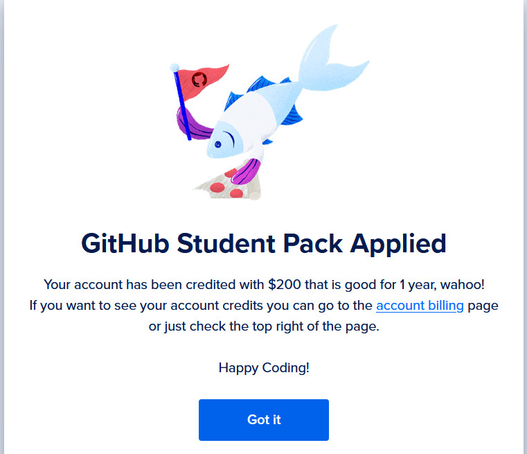

# Linux-palvelimet, syksy 2024. Tehtävä h4: Maailma kuulee

## x) Tiivistelmä: Susanna Lehto, Teoriasta käytäntöön pilvipalvelimen avulla (h4) 14.2.2022 https://susannalehto.fi/2022/teoriasta-kaytantoon-pilvipalvelimen-avulla-h4/
a) Pilvipalvelimen vuokraus ja asennus
- Ohjeet DigitalOceanille ja Namecheapille, jotka saatu GitHub Education-paketin kautta
- kannattaa laittaa maksuhälytykset päälle, jotta muistaa poistaa käytön kurssin jälkeen
- palvelin EU:sta GDPR:n takia
- Namecheapille pitää rekisteröityä erikseen
- DigitalOceanin virtuaalipalvelimen IP-osoite lisätään Namecheapin hallintapaneelissa

d) Palvelin suojaan palomuurilla 
- ssh-yhteys virtuaalipalvelimeen $ ssh root@xxx.xxx.xxx.xxx, jossa xx.. on IP-osoite
- salasana DigitalOceanissa asetettu salasana
- päivitys sudo apt-get update
- palomuurin asennus sudo apt-get install ufw
- reikä palomuuriin sudo ufw allow 22/tpc
- palomuuri päälle sudo ufw enable

e) Kotisivut palvelimelle
- tehdään käyttäjä sudo adduser käyttäjänimi, siitä pääkäyttäjä sudo adduser käyttäjänimi sudo
- root-käyttäjän lukitus sudo usermod -lock root
- Apache-webbipalvelimen asennus sudo apt-get install apache2
- toinen reikä palomuuriin sudo ufw allow 80/tcp
- userdir-moduulii
- käyttäjälle oma kansio, sinne microlla index.html

f) Palvelimen ohjelmien päivitys
- SSH-yhteys, sudo apt-get update, sudo apt-get upgrade, sudo apt-get dist-upgrade

Tiivistelmä Tero Karvinen, First Steps on a New Virtual Private Server – an Example on DigitalOcean and Ubuntu 16.04 LTS 19.9.2017 https://terokarvinen.com/2017/first-steps-on-a-new-virtual-private-server-an-example-on-digitalocean/

- Ohjeet palveluille DigitalOcean ja NameCheap (saatavailla GitHub Education -paketissa)
- tehtyäsi palvelimen DigitalOceaniin, ota yhteys komennolla ssh roo@IP-osoitteesi
- tee palomuurin reikä ja laita sitten palomuuri päälle sudo ufw allow 22/tcp sudo ufw enable
- tee itsellesi käyttäjä ja anna sille sudo-oikeudet
- testaa käyttäjääsi toisella terminaalilla ennen kuin suljet etäyhteyden
- lukitse root-käyttäjätili
- päivitä paketit
- tee Apachelle reikä palomuuriin
- NameCheapista saa halutessaan domain-nimen
- 
- 
- 

## a) Virtuaalipalvelimen vuokraus

17.9.2024 11:28
Olin saanut GitHub Education -paketin toimimaan saatuani vinkin toiselta opiskelijalta ottaa kuvakaappaus Pepistä saatavasta opiskelutodistuksesta, jolla sitten pystyin todistamaan opiskelijastatukseni GitHubiin. Luennolla oli näytetty esimerkkinä DigitalOcean, joka oli ainakin näyttänyt aika selkeältä käyttää, joten päätin ottaa sen ja domain-nimen Namecheapilta, joka oli minulle aiemmin tuttukin. 

Githubin Student Developer Pack -sivulla klikkasin siis kohtaa "Get access by connecting your GitHub account on DigitalOcean ". Ja heti tuli vastaan error. Ajattelin, että käyttämäni VPN-yhteys sotkee, mutta VPN ei ollutkaan edes päällä. Menin sitten suoraan DigitalOCeanin nettisivulle ja klikkain siellä "Sign up" ja GitHub. Tässä kohtaa näkyi teksti "looking for bot" tai jotain sellaista, eli olipa hyvä että VPN ei ollut päällä. Sitten minulta kysyttiin kaikenlaista ja lisäksi maksutiedot. Missään kohtaa en nähnyt, että olisin sisällä GitHubissa, kunnes maksusivuilla näkyi GitHub-käyttäjätunnukseni. Normaalisti käyttäisin Paypalia, kun sellainen vaihtoehto oli tarjolla, mutta laitoin tässä maksukorttini tiedot. Pitivielä varmistaa S-mobiililla. Sitten piti authenticate with GitHub. 

 

 Seuraavaksi näkyviin tuli DigitalOceanin päänäkymä.
 

 Eipä tässä kai auta muu kuin alkaa hankkia sitä palvelinta. Sitä ennen kävin vielä katsomassa billing-osiota. Suomen ALV-nosto oli ehtinyt DigitalOceaniinkin. Asetin hälytyksen, että saan ilmoituksen jos kuukaudessa käytän 20 dollaria.

 Klikkasin etupaneelin kohdasta "Spin up a droplet". (Alkavatkohan nämä hassut termit jossain vaiheessa nyppiä.) Ainoat varteenotettavat vaihtoehdot taitavat olla Frankfurt ja Amsterdam, koska ne ovat EU:ssa ja niin minäkin, ja GDPR koskee meitä kaikkia. En tiedä pystyisikö noita vaihtoehtoja näkemään ennen kuin kirjautuu, jos esimerkiksi haluaisi oikeasti jonkin virtuaalipalvelimen, niin hyvä olisi tietää vaihtoehtoja etukäteen. Otin Frankfurtin. Imageksi otin Debian 12x64.
 

 CPU:ksi valitsin Shared ja CPU options Regular ja siitä halvin, jossa on 1 GB RAM-muistia. Valintaisia tuotteita en ottanut. En osaa käyttää SSH:ta, joten valitsin salasana-vaihtoehdon. Meinasin ensin generoida salasanan F-Securen salasanaholvin avulla, mutta sitten tuli mieleeni, että joudun varmaankin kirjoittamaan sitä komentoriville, ja sellaiseen siitä voi tulla liiankin monimutkainen. 

 En ottanut mitään maksullisia tai ilmaisia lisäpalveluita. En edes backup plania, koska luennolla niin ohjeistettiin. Lopuksi laitoin dropletilleni nimen, sellaisen jolla ei ole niin väliä jos se on julkinen. Sitten klikkasin Create droplet, ja seurasin kuinka sininen palkki alkoi täyttyä, sitten se äkkiä peruutti ja lopulta se meni loppuun asti ja näin IP-osoitteen. Päätin huvikseni pingata IP-osoitetta Windowsin komentorivillä, ja sieltä tuli heti vastaus. En kyllä tiedä mitä se tarkoittaa. (Pidin tauon).

13:45-
## b) Alkutoimet virtuaalipalvelimella: palomuuri, root-tunnuksen sulkeminen ja ohjelmien päivitys

