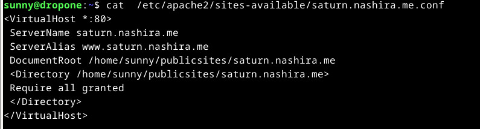

# Linux-palvelimet, syksy 2024. Tehtävä h5: Nimekäs

Rehellisyyden nimissä täytyy sanoa, että tämän raportin teon kanssa pakka hajosi aika pahasti. En enää jälkeenpäin pystynyt sanomaan, että mitä olin tehnyt missäkin kohtaa, etenkin kun joissakin kohdissa olin kaiketi käyttänyt vääriä komentoja, jotka joko toimivat tai eivät toimineet. 


## a) Tehtävänä oli tehdä virtuaalipalvelimelle name based virtual hosting -tekniikalla vähintään kolme erillistä sivua, joiden tuli olla validia HTML:ää ja niiden tuli myös linkittää toisiinsa. Sivuja pitää olla mahdollista muokata ilman pääkäyttäjän oikeuksia.

Lähde: https://terokarvinen.com/2018/04/10/name-based-virtual-hosts-on-apache-multiple-websites-to-single-ip-address/

Otin ssh-yhteyden palvelimelleni `ssh sunny@165.227.153.230` ja tein päivityksen `sudo apt-get udpdate`.

Kävin katsomassa mitä kansiossa /etc/apache2/sites-available oli: siellä oli tiedostot 000-default.conf ja default-ss.conf.

Tsekkasin mitä 000-alkuisesta löytyy ja sieltä löytyi oletusvirtuaalipalvelin konfiguraatio.

Tarkoitus siis olisi tehdä tavallisen käyttäjän oikeuksin kyseisen käyttäjän hakemistoon html-sivut ja palvelimelle virtualhost-tiedosto, jossa kerrotaan mistä html-sivut löytyvät.

Tein uuden tiedoston  `sudoedit /etc/apache2/sites-available/nashira.me.conf`

```
<VirtualHost *:80>

 ServerName nashira.me
 
 ServerAlias www.nashira.me
 
 DocumentRoot /home/sunny/publicsites/nashira.me
 
 <Directory /home/sunny/publicsites/nashira.me>
 
   Require all granted
   
 </Directory>
 
</VirtualHost>
```


Sitten `sudo a2ensite nashira.me` ja komento `sudo systemctl restart apache2´.

Jos nyt yritin katsoa nashira.me-sivun etusivua curl nashira.me-komennolla, sain vastaukseksi 403 forbidden, ja myös selaimella tuli sama varoitus.

Sitten tein käyttäjälleni hakemiston `mkdir -p /home/sunny/publicsites/nashira.me`

Tein yksinkertaisen index.html-sivun, jolla voisin testata, että se tulee näkyviin: `echo "Tässä uusi index.html" > /home/sunny/publicsites/nashira.me/index.html`

Sain edelleen saman 403 virheilmoituksen. Komento `sudo apache2ctl configtest` antoi varoituksen: "could not reliably determined fully qualified domain name".

Tässä kohtaa päätin disabloida nashira.me:n :`sudo a2dissite nashira.me ja `sudo systemctl reload apache2`.

Nyt kun kokeilin `curl nashira.me`, sain vastauksena sen index.sivun sisällön, jolla olin korvannut apachen testisivun.

Sitten disabloin palvelimen oletus-virtuaalipalvelimen `sudo a2dissite 000-default.conf` ja sen jälkeen `systemctl reload apache2`.

Tässä kohtaa sain varoituksia. Laitoin uudelleen `sudo systemctl reload apache2` enkä saanut varoitusta....mutta mitä on tapahtunut? Myöhemmin tajusin, että olin laittanut a2dissite ja a2ensite-komentoihin ".conf"-päätteet, mitä ei olisi pitänyt tehdä.

`curl nashira.me` antoi edelleen alkuperäisen eli "Nothing to see here"-tekstin, jolla siis olin korvannut Apachen oletussivun.

Laitoin takaisin `sudo a2ensite 000-default.conf` ja `sudo systemctl reload apache2`. Edelleen siis käytin väärää muotoa a2ensite-komennosta. Ja edelleen `curl nashira.me antoi oletussivun sisällön.

Tässä kohtaa en enää osaa sanoa, että mitä tein ja milloin. Lopulta kuitenkin menin kansioon home/sunny/publicsites/nashira.me ja tein sinne index-sivun. Samaan kansioon tein sivut yksi.html ja kaksi.html. Sivut siis toimivat niin, että index.html näkyy päädomainissa eli nashira.me-sivulta, ja kaksi muuta sivua on siitä linkitetty.


### b) Alidomainit, toinen A-tietueella ja toinen CNAME-tietueella

Menin Namecheap.comiin ja tein siellä uuden A-recordin


Otin ssh-yhteyden palvelimelleni ja sen jälkeen suoritin komennon `sudoedit /etc/apache2/sites-available/saturn.nashira.me.conf` ja laitoin sinne tiedot saturn-alidomainille.



Sen jälkeen komennot `sudo a2ensite saturn.nashira.me` ja `sudo systemctl restart apache2`. 

Sitten tein käyttäjälle kansion `mkdir -p /home/sunny/publicsites/saturn.nashira.me/ 
ja kirjoitin sinne echo "saturn publicsites-kansiosta" > /home/sunny/publicsites/saturn.nashira.me/index.html

Nyt `curl saturn.nashira.me`-komennolla sain esiin tekstin, jonka olin laittanut äskeiseen index-tiedostoon. 

Toisen alidomainin tein CNAME-recordilla. Eli menin Namecheap.comiin ja lisäsin siellä CNAME-tietueen, jonka value-kohtaan laitoin "nashira.me".

Kopioin saturn-alidomainin konfiguraatiotiedoston sisällön mars.narhira.me-tiedostoon, ja sen jälkeen vaihdoin siellä vain saturn-sanat mars.sanoihin. Sitten suoritin komennot `sudo a2ensite mars.nashirame` ja `sudo systemctl restart apache2`.

Sitten tein taas kansion ja sinne index.html-tiedoston: `mkdir -p /home/sunny/publicsites/mars.nashira.me/ 
ja `echo "mars publicsites-kansiosta" > /home/sunny/publicsites/mars.nashira.me/index.html`.

Mars-curl toimii, mutta webbisivulla ei näkynyt mitään.

Olin aikaisemmin tehnyt toisen CNAME-recordin, ja nyt deletoin sen Nameheapista, jos se auttaisi mars.nashira.me-sivua näkymään. Mutta nyt kävikin niin että se vanha alidomain (jupiter) ohjautui nashira.me-sivulle. No entä jos deletoin mars-domainin CNAME-recordin. Edelleenkään ei tapahtunut mitään, eli vian täytynee olla virtuaalipalvelimen konfiguraatiossa. Tarkistin ne, eikä niissä näkynyt vikaa.

Nyt myös huomasin, että aikaisempi alidomain, jonka CNAME-recordin olin siis poistanut, oli sekin lakannut toimimasta, kun se aikaisemmin ohjaisi ylempään domainiin.

Tarkistin, että saturn ja mars-alidomainien index-sivuilla oli myös samat oikeudet. 

Nyt huomasin, että `curl mars.nashira.me` ei sekään enää toiminut. 

Menin taas namecheap.comiin ja lisäsin sinne CNAME-recordin mars.nashira.me:lle. Se oli nyt siis ainoa CNAME-tietue. Jonkin ajan päästä mars.nashira.me alkoi toimia.


### c) SSH-avaimen luominen
Lähde: https://www.digitalocean.com/community/tutorials/how-to-create-ssh-keys-with-openssh-on-macos-or-linux

Kirjauduin paikalliselle Linux-koneelle ja kirjoitin komentoriville `ssh-keygen`. Sen jälkeen näkyviin kolmeen kysymykseen painoin kaikkiin enteriä. 


Kävin katsomassa, että kansioon oli tullut private ja public key.


Komennolla `ssh-copy-id käyttäjätunnus@[IP-osoite]` kopioin julkisen avaimen virtuaalipalvelimelleni. Sen jälkeen pystyin kirjautumaan palvelimelle ssh-komennolla ilman salasanaa.


Kävin vielä katsomassa palvelimella omassa kansiossa .ssh-alikansiossa katsomassa, että sinne oli tullut kyseinen julkinen avain.


### d) Host- ja dig-komennot 

Tehtävänä oli tutkia host- ja dig-komennoilla omiin sivuihin, jonkun pienen yrityksen tai henkilön kotisivuihin ja jonkin tunnetun palvelun sivuihin.

Tein komennon `man host`. Manuaalisivujen mukaan host-komennolla voi selvittää, mikä IP-osoite on tietyn domain-nimen takana ja päin vastoin. 

Dig-kommento ei toiminut, joten installoin ensin `sudo apt-get install dnsutils` (Lähde: https://linuxize.com/post/how-to-use-dig-command-to-query-dns-in-linux/ ). Sitten pystyin lukemaan dig-manuaalia, joka oli todella tekninen. Komennolla `dig all domainnimi` näkee kaikki tiedot.

Host-komento näyttää domain-nimen IP-osoitteen ja sähköpostipalvelimet.


Dig-toiminnon analyysin lähteenä käytetty sivusto: https://www.howtogeek.com/663056/how-to-use-the-dig-command-on-linux/.

Ensimmäisellä rivillä näkyy Digin versio ja domain, jonka tietoja haettiin.

Global options: +cmd Tässä kohtaa näkyy oletuksena +cmd. Dig-komennon voisi tehdä myös moneen domainiin yhtä aikaa, ja tässä näkyisi hakujen vaihtoehdot.

HEADER:

flags: qr rd ra - nämä liittyvät rekursioon, josta en osaa sanoa sen enempää. Lähde: https://www.howtouselinux.com/post/linux-dig-dns

Opcode: Query eli kysely, voisi olla myös inverse query tai status.

Status: No error, ei ollut virheitä

id: 2021 - satunnainen id kyselylle

Query 1 - lähetettiin yksi kysely

Answer 1 - saatiin yksi vastaus 

Authority 0, yhtään vastausta ei tullut "authoritative" nimipalvelimelta

Additional 1 : lähteen mukaan mitään ei näy, ellei tässä ole 2 tai korkeampi numero

OPT PSEUDOSECTION
EDNS: Version: 0 - Extension System for DNS versio

flags: kyselyssä ei ollut flageja

udp: 1232 - udp-paketin koko

COOKIE: Ilmeisesti kyselylle asetettu eväste, sen voi estää laittamalla dig +nocookie (Lähde: https://metebalci.com/blog/a-short-practical-tutorial-of-dig-dns-and-dnssec/)

QUESTION SECTION:

nashira.me - domain, josta kysely tehdään

ANSWER SECTION:

292 - Time to Live,

IN - Internet, "internet class" -kysely

A - pyynnössä pyydettin A-tietuetta

Muut:

Query time: 12 msec, aika joka vastaukseen meni

SERVER: Vastanneen DNS-palvelimen IP-osoite ja porttinumero

WHEN: milloin pyyntö tehtiin

MSG SIZE rcvd: 83 - Vastauksen koko


