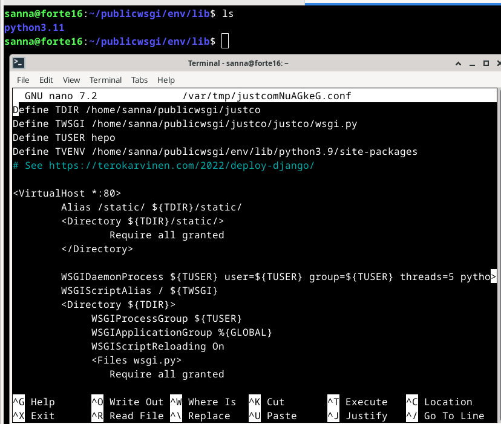

# Linux-palvelimet, syksy 2024. Tehtävä h6: Hello Django
Kurssisivut https://terokarvinen.com/linux-palvelimet/

### Laitteisto

- Prosessori i5-11H
- RAM 8,00 GB
- HDD 512 GB, tyhjää tilaa 156 GB
- Järjestelmätyyppi 64 bit
- Käyttöjärjestelmä Windows 11
- Oracle VM VirtualBox
- Debian 12

## a) Yksinkertainen esimerkkiohjelma Djangolla
### Djangon asentaminen

Djangon asennusohjeet: https://terokarvinen.com/2022/django-instant-crm-tutorial/

Aloitus klo 11:00

Kirjauduin paikalliselle Linux-koneelle ja tein komennot `sudo apt-get update` ja `sudo apt-get upgrade`. Varmistin, että olin kansiossa home/sanna/ ja tein komennon `sudo apt-get -y install virtualenv`, minkä jälkeen tein komennon `virtualenv --system-site-packages -p python3 env/`.


Ja sen jälkeen `source env/bin/activate`. Nyt komentorivin alkuun tuli "(env)", eli virtuaaliympäristö oli päällä.


Suoritin komennon `which pip`, jotta näin käyttäväni virtuaaliympäristön pip-ohjelmaa.

Asensin virtuaaliympäristöön micron komennolla `sudo apt-get install micro`, kirjoitin salasanani ja sen jälkeen loin tiedoston "requirements.tx" komennolla `micro requirements.txt`.

Tiedostoon kirjoitin sanan "django" ja talletin tiedoston. Cat-komennolla varmistin, että tiedostossa lukee oikein: `cat requirements.txt`.

Sen jälkeen asensin Djangon komennolla `pip install -r requirements.txt`, ja sen jälkeen katsoin asentamani Djangon version: `django-admin --version`.


### Uusi Django-projekti

Aloitin uuden projektin komennolla `django-admin startproject testco`.

Menin testco-hakemistoon komennolla `cd testco` ja listasin sen sisällön. Sieltä löytyi manage.py sekä alihakemisto, joka oli myös nimeltään testco. Alihakemistossa oli useampi .py-päätteinen tiedosto.

Palasin ylöspäin ensimmäiseen testco-hakemistoon ja suoritin siellä komennon `./manage.py runserver`.


Menin selaimella komentokehotteessa mainittuun osoitteeseen ja kävin katsomassa myös Admin-paneelin, jossa näkyi login-sivu.


Terminaaliin oli tullut erilaisia ilmoituksia, kun olin vieraillut admin-sivustolla.


Sitten suoritin komennot `./manage.py makemigrations` ja `./manage.py migrate`. Komennoista ei tullut mitään näkyviä "tuloksia". Sitten tajusin, ettei komentoja olisi pitänyt kirjoittaa siihen terminaaliin, jossa palvelin pyörii. Mitään ei ollut tapahtunut, joten suljin varmuudeksi palvelimen ja laitoin sen taas pyörimään. Avasin terminaalissa uuden välilehden, johon voisin kirjoittaa samalla kun palvelin näkyy toisessa välilehdessä.

Suoritin uudelleen komennot `./manage.py makemigrations` ja `./manage.py migrate`. Sain virheilmoituksen "/usr/bin/env: 'python' : No such file or directory". Tajusin, että avaamani uusi komentorivi ei ollut virtuaaliympäristössä. Varmistin siis, että olin kotihakemistossa ja suoritin komennon `source env/bin/activate`, ja komentorivin eteen tuli taas (env).  Yritin vielä kerran suorittaa makemigrations-komennon väärässä hakemistossa, kunnes päädyin oikeaan hakemistoon eli testco-hakemistoon, jossa suoritin `./manage.py makemigrations` ja `./manage.py migrate`.


### Käyttäjien lisääminen

Kokeilin salasanageneraattoria eli ensin asensin generaattorin komennolla `sudo apt-get install pwgen` ja generoin sitten salasanan komennolla `pwgen -s 20 1`.


Lisäsin käyttäjän komennolla `./manage.py createsuperuser`. Jätin käyttäjänimen tyhjäksi, jolloin nimeksi tuli senhetkinen käyttäjänimeni. Myös sähköpostin jätin tyhjäksi. 


Nyt pääsin kirjautumaan admin-paneeliin juuri tekemälläni käyttäjällä.


Tein toisen käyttäjän samalla tavalla kuin ensimmäisen. Sen jälkeen kirjauduin ensimmäisellä käyttäjällä ulos ja toisella sisään. (Tästä ei ole kuvakaappausta, mutta jatkossa näkyy, että käyttäjä on sunny eikä sanna.)

Tauko 12:45-13:30

### Asiakastietokannan luominen

Koska olin pitänyt tauon ja kirjautunut ulos, niin aktivoin virtuaaliympäristön, menin testco-hakemistoon ja käynnistin serverin (./manage.py runserver).

Avasin toisen terminaalivälilehden ja suoritin komennon `./manage.py startapp crm`. Olin taas unohtanut, että en ole virtuaaliympäristössä, joten tein samat toimenpiteet kuin aiemmin virtuaaliympäristön käynnistämiseksi, menin testco-hakemistoon ja suoritin siellä komennon `./manage.py startapp crm`.

Avasin settings.py-tiedoston micro-editorissa komennolla `micro testco/settings.py` ja lisäsin tiedostossa olevan listan loppuun "'crm',".


Sen jälkeen lisäsin crm/models.py-tiedostoon seuraavat rivit:

```
from django.db import models

class Customer(models.Model):
   name = models.CharField(max_length=300)

```
Sitten suoritin taas komennot `./manage.py makemigrations` ja `./manage.py migrate`.

Rekisteröin uuden tietokannan muokkaamalla crm/admin.py-tiedostoa micro-editorilla: `micro crm/admin.py`ja lisäsin sinne

```
from django.contrib import admin
from . import models

admin.site.register(models.Customer)
```

Kirjauduin admin-paneeliin viimeisimmällä käyttäjänimellä, jonka olin luonut, ja nyt näkymässä näkyi CRM ja Customers.


Pystyin lisäämään asiakkaille nimiä, mutta nimet eivät näkyneet Customer-listauksessa, vaan siellä näkyi Customer object (1) jne.


Aloin muokata models.py-tiedostoa. Tässä vaiheessa huomasin että "from django.db import models" oli tiedostossa kahteen kertaan, joten poistin niistä toisen. Tuplarivillä tuskin oli ollut mitään vaikutusta. Lisäsin tiedostoon kuvassa näkyvät kaksi riviä ja vaihdoin maksimipituudeksi 160.


Tässä vaiheessa palvelin kaatui selaimessa. Lokin mukaan kyseessä oli IndentationError juuri muokkaamassani models.py-tiedostossa. Varmistin, että tiedostossa rivit olivat joko vasemmassa reunassa tai tabuloituna, ja jonkin ajan päästä huomasin, että return-rivi piti sisentää vielä yhden kerran. Virhelokissahan se lukikin. (Poistin myös crm/admin.py-tiedostosta ylimääräisen import-rivin, jonka olin sinnekin epähuomiossa laittanut.)

Virheilmoituksia:


Sisennyksen korjaus:


Suoritin komennon `./manage.py runserver` ja palvelin alkoi pyöriä. Huomasin, että olin edelleen kirjautuneena sisään, vaikka palvelin oli välillä selaimessa kaatunut. Nyt Customers-taulussa näkyi asiakkaiden nimet.


Lopetus 14:20.

## b) Djangon tuotantotyyppinen asennus

Aloitus 10:30-

Ohjeet: https://terokarvinen.com/2022/django-instant-crm-tutorial/

Kirjauduin sisään virtuaalikoneelle ja Linuxiin ja suoritin `sudo apt-get update`, minkä jälkeen asensin bash-completionin: `sudo apt-get -y install bash-completion` ja asetin micro-editorin oletuseditoriksi: `export EDITOR=micro`.

Ohjeissa neuvotaan asentamaan Apache2, mutta koska olin jo aiemmin asentanut sen, niin tutkin minkälaiset asetukset siinä nyt olivat. Kun menin selaimella localhost-osoitteeseen, niin siellä luki"default", jonka olin siis itse kirjoittanut sinne. Muistin virkistykseksi etsin, että teksti tulee kansiossa /var/www/html olevasta index.html-tiedostosta. Varmistin asian muokkaamalla tekstiä hieman.


### Web-sisältöä

Menin omaan kotihakemistooni ja suoritin seuraavat komennot: `mkdir -p publicwsgi/testco/static/` ja `echo "Teksti tulee static-kansiosta."|tee publicwsgi/testco/static/index.html`.


Uuden virtuaalihostin luomiseksi tein komennon `sudoedit /etc/apache2/sites-available/testco.conf` ja kirjoitin tiedostoon

```
<VirtualHost *:80>
	Alias /static/ /home/sanna/publicwsgi/testco/static/
	<Directory /home/sanna/publicwsgi/testco/static/>
		Require all granted
	</Directory>
</VirtualHost>
```

Tämän jälkeen ohjeissa neuvotaan laittamaan uusi testco.conf päälle ja ottamaan pois muut conf-tiedostot. Halusin selvittää, mitkä conf-tiedostot tällä hetkellä
olivat laitteessani päällä. 

ChatGPT 4.0 neuvoi katsomaan listauksia sites-enabled ja sites-available ja vertailemalla niitä. Jos tiedostoa ei ole ensimmäisessä listassa, niin se ei ole päällä. Kaipa se olisi näkynyt jo pelkästään ensimmäisestä listauksesta

CHATGPT:
`ls -l /etc/apache2/sites-enabled/`
`ls -l /etc/apache2/sites-available/`


Tuloksista näin, että kolme conf-tiedostoa oli päällä: 000-default.conf sekä aiempien tehtävien kettu ja kissa-sivut.

Päätin kokeilla ottaa pos päältä vain defaultin: `sudo a2ensite testco.conf` ja `sudo a2dissite 000-default.conf`.

Tarkistin onko konfiguraation syntaksi oikein: `/sbin/apache2ctl configtest` ja sen jälkeen uudelleenkäynnistin Apachen `sudo systemctl restart apache2`.

(Tässä vaiheessa virtuaalikone alkoi jotenkin temppuilla ja näytti ikkunoita välillä päällekkäin, kenties RAM-muistia ei ollut tarpeeksi. Jossain vaiheessa temppuili taisi loppua.)

Menin osoitteeseen localhost/static/, mutta sieltä tuli virheilmoitus "404 not found". Pelkästä localhostista sen sijaan näkyi teksti "kettu", eli ilmeisesti vanha kettu-sivu näkyin nyt siellä, kun default-konfiguraatio oli pois päälä. Päätin siis ottaa pois päältä myös kettu ja kissa-sivujen conf-tiedostot. Ja sen jälkeen taas `sudo systemctl restart apache2`.

Nyt localhost/static/ selaimessa näytti tekstin, jonka olin laittanut static-kansioon.


### Djangon asennus virtuaaliympäristöön

Olin aikaisemmassa tehtävässä asentanut virtualenvin, joten menin home/sanna/publicwsgi/-kansioon ja suoritin siellä komennon 

`virtualenv -p python3 --system-site-packages env`. Kansioon tuli uusi alikansio "env".

Laitoin virtuaaliympäristön päälle komennolla `source env/bin/activate`. Sitten vastaavasti kuin a-tehtävässä tarkistin, että pip tulee env-kansion
alta, kirjoitin requirements.txt-tiedostoon sanan "django" ja asensin Djangon komennolla `pip isntall -r requirements.txt`. Lopuksi vielä tarkistin, mikä versio Djangosta on asennettu.


### Uuusi Django-projekti

Suoritin komennon `django-admin startproject testco`, mutta sain ilmoituksen, että testco-alihakemisto on jo olemassa. Olinhan tosiaan luonut kyseisen alikansion, kun luin sille static-alikansion. Päätin tehdä projektin toisella nimellä.

Suoritin komennon sudoedit `/etc/apache2/sites-available/justco.conf`. Tässä kohtaa ymmärsin väärin ohjeista, että pitäisi tehdä uusi käyttäjä, jolla ei ole sudo-oikeuksia, ja siksi laitoin conf-tiedostoon käyttäjän "hepo". 


Sitten suoritin komennon `sudo apt-get -y install libapache2-mod-wsgi-py3`. (Tein tämän kaiken ei-virtuaaliympäristössä.) Testasin configtest-toiminolla syntaksin `/sbin/apache2ctl configtest`ja sen jälkeen `sudo systemctl restart apache2`.

Tein komennon `curl -s localhost|grep title` mutta mitään ei tapahtunut.


Mietin että oliko minulla justco.conf päällä, ja kun katsoin niin se oli kyllä olemassa, mutta ei päällä. Ainoastaan testco.conf oli päällä, ja senhän olin siis halunnut muuttaa justco.confiksi.


Suoritin komennot `sudo a2ensite justco.conf` ja `sudo a2dissite testco.conf` ja sitten `sudo systemctl restart apache2`.

Jotain uutta tapahtui, sillä nyt sain Internal server errorin.


Katsoin virhelokia komennolla `sudo tail /var/log/apache2/error.log`.


Kysyin neuvoa ChatGPT:ltä, ja se selitti jotain VirtualHostista. Tässä vaiheessa jouduin nousemaan hetkeksi pois koneelta, ja hetken hengähdettyäni mieleeni tuli, että olivatkohan tekemäni VirtualHost-tiedoston polut oikein. Tarkistin polut tutkimalla samalla tiedostopolkuja koneessani ja löysin eron: tiedostopolussa oli 3.11, mutta VirtualHostissa oli 3.9.




Muutin sen siis justco.conf-tiedostossa numeroon 3.11. ja sen jälkeen suoritin `sudo systemctl restart apache2`. Localhostissa näkyi nyt Django.


Tarkistin vielä, että se pyörii Apachella:


Sen sijaan, jos yritin mennä localhost/static/-kansioon selaimessa, niin sain forbidden-virheilmoituksen, jota vähän uumoilinkin, koska olin tehnyt sen ennen kuin tein uuden projektinimen.

Tein nyt siis  uuden static-kansion osoitteeesen home/sanna/publicwsgi/justco/static ja localhost/static alkoi toimia.


### DEBUGin poisto

Avasin settings.py-tiedoston justco-alihakemistossa ja muokkasin siellä

```
DEBUG  = False
ALLOWED_HOSTS = ["localhost"]
```

Sitten tein komennot `touch justco/wsgi.py` ja `sudo systemctl restart apache2`.

Nyt etusivulla ei näkynyt mitään ja myöskään "localhost/moi"-sivulla ei näkynyt mitään, niin kuin ei pitänytkään.


Admin-sivu näytti tältä:


Halusin tehdä uuden käyttäjän Djangolle. (Tässä vaiheessa kävin vaihtassa VirtualHost-tiedostoon hepon tilalle "sanna", koska ymmärsin käsittäneeni ohjeen väärin.) Suoritin virtuaaliympäristössä komennon `./manage.py createsuperuser` ja ruutu täyttyi virheilmoituksista.


Ilmoituksissa mainittiin "migrate", joten tein komennot `./manage.py makemigrations` ja `./manage.py migrate`. Sen jälkeen pystyin tekemään käyttäjän `sudo createsuperuser`-komenolla ja pääsin kirjautumaan sillä sisään admin-paneeliin.


Sitten muokkasin settings.py-tiedostoa, johon lisäsin kaksi riviä:

```
import os
STATIC_ROOT = os.path.join(BASE_DIR, 'static/')
```


ja sitten suoritin komennon `./manage.py collestatic`.


Admin-paneeli oli nyt muuttanut ulkonäköään.


Lopetus klo 15:00.
