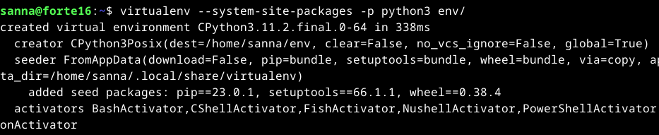

# Linux-palvelimet, syksy 2024. Tehtävä h6: Hello Django

### Laitteisto

- Prosessori i5-11H
- RAM 8,00 GB
- HDD 512 GB, tyhjää tilaa 156 GB
- Järjestelmätyyppi 64 bit
- Käyttöjärjestelmä Windows 11
- Oracle VM VirtualBox
- Debian 12

### Djangon asentaminen

Djangon asennusohjeet: https://terokarvinen.com/2022/django-instant-crm-tutorial/

Aloitus klo 11:00

Kirjauduin paikalliselle Linux-koneelle ja tein komennot `sudo apt-get update` ja `sudo apt-get upgrade`. Varmistin, että olin kansiossa home/sanna/ ja tein komennon `sudo apt-get -y install virtualenv`, minkä jälkeen tein komennon `virtualenv --system-site-packages -p python3 env/`.



Ja sen jälkeen `source env/bin/activate`. Nyt komentorivin alkuun tuli "(env)", eli virtuaaliympäristö oli päällä.


Suoritin komennon `which pip`, jotta näin käyttäväni virtuaaliympäristön pip-ohjelmaa.

Asensin virtuaaliympäristöön micron komennolla `sudo apt-get install micro`, kirjoitin salasananani ja sen jälkeen loin tiedoston "requirements.tx" komennolla `micro requirements.txt`.

Tiedostoon kirjoitin sanan "django" ja talletin tiedoston. Cat-komennolla varmistin, että tiedostossa lukee oikein: `cat requirements.txt`.

Sen jälkeen asensin Djangon komennolla `pip install -r requirements.txt`, ja sen jälkeen katsoin asentamani Djangon version: `django-admin --version`.


### Uusi Django-projekti

Aloitin uuden projektin komennolla `django-admin startproject testco`.

Menin testco-hakemistoon komennolla `cd testsco` ja listasin sen sisällön. Sieltä löytyi manage.py sekä alihakemisto, joka oli myös nimeltään testco. Alihakemistossa oli useampi .py-päätteinen tiedosto.

Palasin ylöspäin ensimmäiseen testco-hakemistoon ja suoritin siellä komennon `./manage.py runserver`.


Menin selaimella komentokehottesssa mainittuun osoitteeseen ja kävin katsomassa myös Admin-paneelin, jossa näkyi login-sivu.


Terminaaliin oli tullut erilaisia ilmoituksia, kun olin vieraillut admin-sivustolla.


Sitten suoritin komennot `./manage.py makemigrations` ja `./manage.py migrate`. Komennoista ei tullut mitään näkyviä "tuloksia". Sitten tajusin, ettei komentoja olisi pitänyt kirjoittaa siihen terminaaliin, jossa palvelin pyörii. Mitään ei ollut tapahtunut, joten suljin varmuudeksi palvelimen ja laitoin sen taas pyörimään. Avasin termiinalissa uuden välilehden, johon voisin kirjoittaa, samalla kun palvelin näkyy toisessa välilehdessä.

Suoritin uudelleen komennot `./manage.py makemigrations` ja `./manage.py migrate`. Sain virheilmoituksen "/usr/bin/env: 'python' : No such file or directory". Tajusin, että avaamani uusi komentorivi ei ollut virtuaaliympäristössä. Varmistin siis, että olin kotihakemistossa ja suoritin komennon `source env/bin/activate`, ja komentorivin eteen tuli taas (env).  Yritin vielä kerran suorittaa makemigrations-komennon väärässä hakemistossa, kunnes päädyin oikeaan hakemistoon eli testco-hakemistoon, jossa suoritin `./manage.py makemigrations` ja `./manage.py migrate`.


### Käyttäjien lisääminen

Sitten kokeilin salasanageneraattoria eli ensin asensin generaattorin komennolla `sudo apt-get install pwgen` ja generoin sitten salasanan komennolla `pwgen -s 20 1`.


Lisäsin käyttäjän komennolla `./manage.py createsuperuser`. Jätin käyttäjänimen tyhjäksi, jolloin nimeksi tuli senhetkinen käyttäjänimeni. Myös sähköpostin jätin tyhjäksi. 


Nyt pääsin kirjautumaan admin-sivuilla juuri tekemälläni käyttäjällä.


Tein toisen käyttäjän samalla tavalla kuin ensimmäisen. Sen jälkeen kirjauduin ensimmäisellä käyttäjällä ulos ja toisella sisään.

Tauko 12:45-13:30

### Asiakastietokannan luominen

Koska olin pitänyt tauon ja kirjautunut ulos, niin aktivoin virtuaaliympäristön, menin testco-hakemistoon ja käynnistin serverin (./manage.py runserver).

Avasin toisen terminaalivälilehden ja suoritin komennon `./manage.py startapp crm`. Olin taas unohtanut, että en ole virtuaaliympäristössä, joten tein samat toimenpiteet kuin aiemmin virtuaaliympäristön käynnistämiseksi, menin testco-hakemistoon ja suoritin ja suoritin siellä komennon `./manage.py startapp crm`.

Avasin settings.py-tiedoston micro-editorissa komennolla `micro testco/settings.py` ja lisäsin tiedostossa olevan listan loppuun "'crm',".


Sen jälkeen lisäsin crm/models.py-tiedostoon seuraavat rivit:

```
from django.db import models

class Customer(models.Model):
   name = models.CharField(max_length=300)

```
Sitten suoritin taas komennot `./manage.py makemigrations` ja `./manage.py migrate`.

Rekisteröin uuden tietokannan muokkaamalla crm/admin.py-tiedostoa micro-editorilla: `micro crm/admin.py`ja lisäsin sinne

```
from django.contrib import admin
from . import models

admin.site.register(models.Customer)
```

Palvelin pyöri koko ajan taustalla.

Loggasin admin-paneeliin viimeisimmällä käyttäjänimellä, jonka olin luonut, ja nyt näkymässä näkyi CRM ja Customers.


Pystyin lisäämään asiakkaille nimiä, mutta nimet eivät näkyneet Customer-listauksessa, vaan siellä näkyi Customer object (1) jne.


Aloin muokata models.py-tiedostoa. Tässä vaiheessa huomasin että "from django.db import models" oli tiedostossa kahteen kertaan, joten poistin niistä toisen. Tuplarivillä tuskin oli ollut mitään vaikutusta. Lisäsin tiedostoon kaksi riviä ja vaihdoin maksimipituudeksi 160.


Tässä vaiheessa palvelin kaatui selaimessa. Lokin mukaan kyseessä oli IndentationError juuri muokkaamassani models.py-tiedostossa. Varmistin, että tiedostossa rivit olivat joko vasemmassa reunassa tai tabuloituna, ja jonkin ajan päästä huomasin, että return-rivi piti sisentää vielä yhden kerran. Virhelokissahan se lukikin. (Poistin myös crm/admin.py-tiedostosta ylimääräisen import-rivin, jonka olin sinne epähuomiossa laittanut.)


Suoritin komennon `./manage.py runserver` ja palvelin alkoi pyöriä. Huomasin, että olin edelleen kirjautuneena sisään, vaikka palvelin oli välillä selaimessa kaatunut. Nyt Customers-taulussa näkyi asiakkaiden nimet.


Lopetus noin klo 14:30.

