## Linux-palvelimet, syksy 2024. Tehtävä h7: Maalisuora

## a) Tehtävä: Kirjoita ja aja "Hei maailma" kolmella kielellä

Pyysin ChatGPT:tä (4.0) suosittelemaan kolmea ohjelmointikieltä, jotka eivät ole Java (josta minulla on jo jonkin verran kokemusta) eikä Python (koska se esimerkki tehtiin jo tunnilla). ChatGPT:n ehdotukset olivat C, Ruby ja Go.

### "Hei maailma" C-kielellä
Käytetyt ohjeet: https://ost.sdsu.edu/kb/faq.php?id=152

Kirjauduin sisään Linuxiin, avasin terminal emulatorin ja suoritin komennon` which gcc`, joka näyttää mikä versio gcc-ohjelmasta ajetaan oletuskena. Jos ohjelmaa ei olisi asennettuna, niin komento ei näytä mitään. Nyt siis sain tiedon, että gcc on jo valmiina koneella.

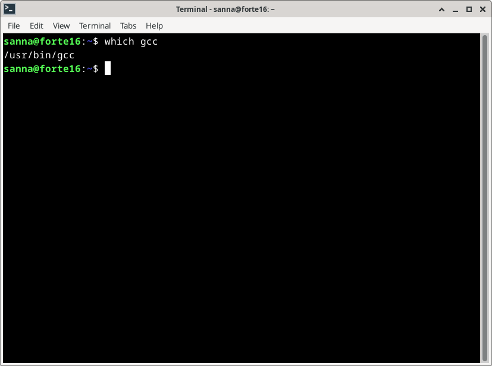

Yllä mainitussa ohjeessa kehotettiin kääntämään koodi komennolla `gcc [programName].c -o programName`. Mutta muistelin, että tuntiesimerkissä ei ollut ihan tuollaista syntaksia, joten kysyin ChatGPT:ltä ovatko kaikki termit välttämättömiä. ChatGPT kertoi, että ilman ”-o programName” termiä ohjelman nimeksi tulee a.out, jonka muistinkin tuntiesimerkistä. Päätin siis käyttää "-o"-parametriä, jotta ohjelmalle tulee oma nimi.

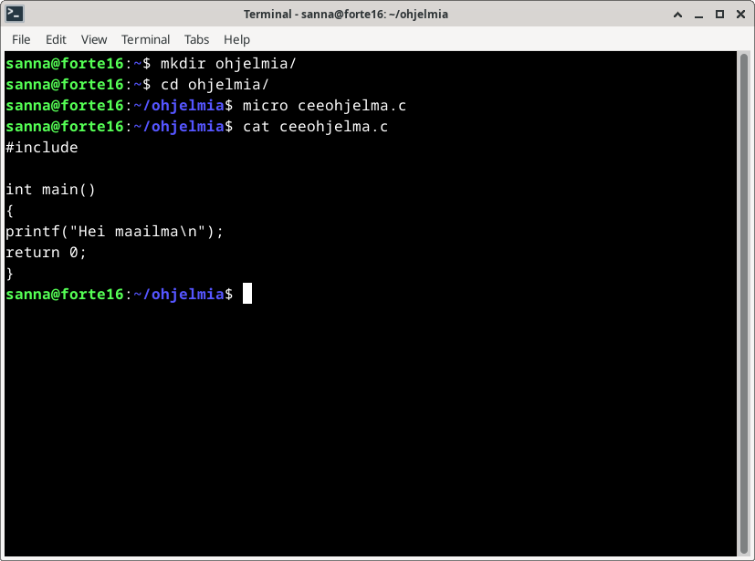

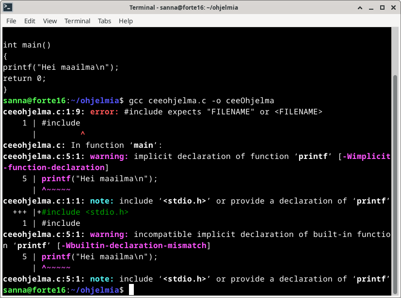

Yritin siis ohjeen https://ost.sdsu.edu/kb/faq.php?id=152 mukaan, ja ensin sain virheilmoituksen, koska stdio.h-kohta  puuttui.

Lisäsin koodiin \<stdio.h>, käänsin sen uudelleen ja ajoin komennolla `./ceeOhjelma`. (Olin ”fiksannut” ohjelman nimen camelcase-muotoon).

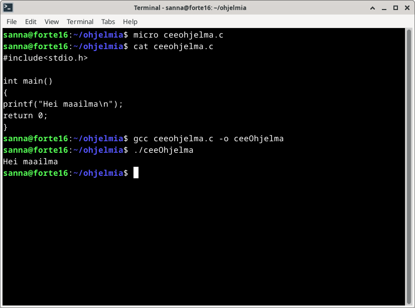

### "Hei maailma" Ruby-kielellä
Ohjeet: https://www.geeksforgeeks.org/how-to-install-ruby-on-linux/

Kokeilin komennolla `which ruby`, että koneella tosiaan ei ollut rubya.

Sivustolta https://www.ruby-lang.org/en/documentation/installation/#apt löytyneen tiedon
perusteella Rubyn  voi asentaa paketinhallinan kautta komennolla `sudo apt-get install ruby-full`.

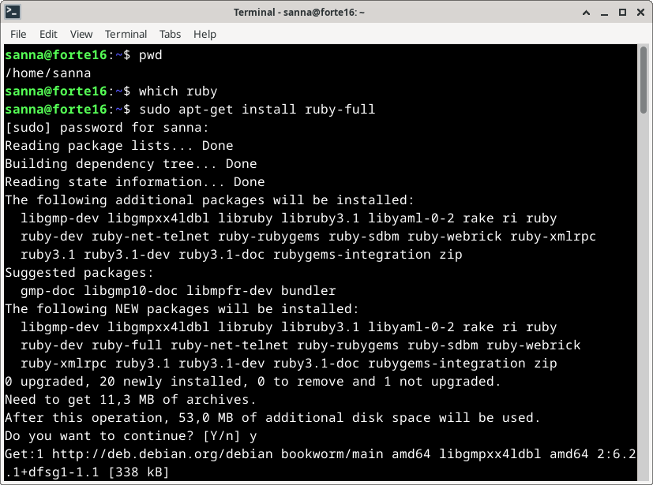

Sitten tein ohjeen mukaan pienen ohjelman tiedostoon "rubyOhjelma.rb", eli kirjoitin sinne `puts "Hei maailma"` ja ajoin sen ruby-komennolla.

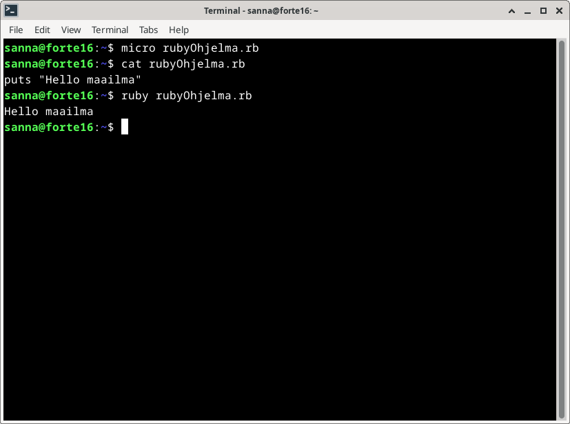

### "Hei maailma" Go-kielellä

Go-kielen asentaminen vaikutti vähän mutkikkaammalta kuin Rubyn. Löysin useita ohjeita, jotka olivat kaikki vähän erilaisia. Ensin ajattelin noudattaa DigitalOceanin sivulta löytyvää ohjetta, mutta sitten vahingossa päädyin sivun alalaitaan, jossa joku kommentoi, että ohjeissa olisi virhe. Päätin sitten yhdistellä kolmen eri sivuston ohjeita, eli tarkistaa niistä ristiin, että ne antavat samanlaisia ohjeita. 

Koska tein tämän kohdan eri päivänä kuin aiemmat, niin suoritin ensin komennot `sudo apt-get update` ja `sudo apt-get upgrade`. Firefox tykkäsi taas päivittyä, minkä jälkeen selain piti käynnistää uudelleen.

Päätin ladata asennustiedoston selaimella. Menin siis osoitteeseen https://go.dev/dl/ ja siellä Featured Downloads -kohdasta tallensin tiedoston osoitteesta https://go.dev/dl/go1.23.2.linux-amd64.tar.gz. Se latautui automaattisesti kansioon home/sanna/Downloads.

Sitten suoritin komennon `sudo tar -C /usr/local -xzf go1.23.2.linux-amd64.tar.gz`, joka purki arkiston kansioon /usr/local.

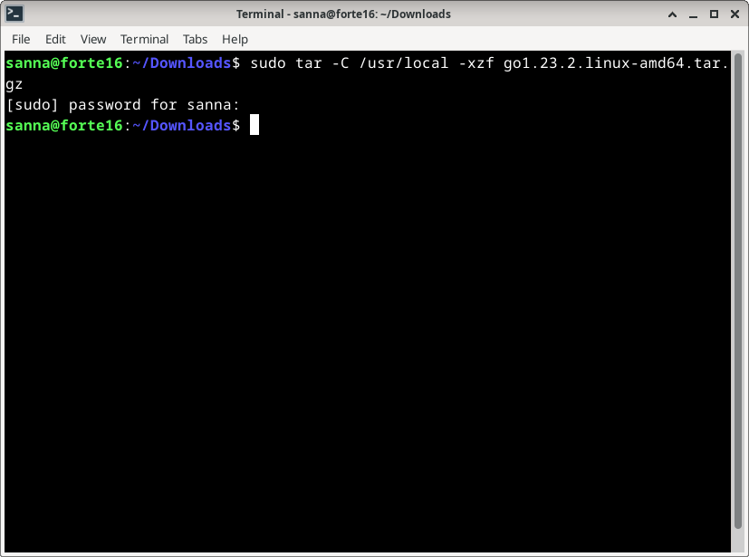

 Seuraavaksi asetin PATH-muuttujan tämän https://linuxcapable.com/how-to-install-golang-go-on-debian-linux/ ohjeen mukaan. 

 `echo "export PATH=/usr/local/go/bin:${PATH}" | sudo tee -a $HOME/.profile`

Näin path-muuttuja päivitettiin kyseiselle käyttäjälle.

Sen jälkeen tein komennon source $HOME/.profile, jotta path-muuttuja päivittyy heti.

 Mutta nyt kun katsoin echo-komennolla path-muttuujaa, oli go siellä ensimmäisenä, eli aina kun joku komento suoritetaan, sitä etsitään ensin go-directorysta. 
 
 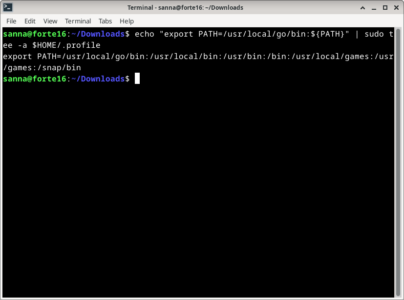

Kysyin ChatGPT:ltä miten voin korjata asian. ChatGPT neuvoi muokkaamaan path-tiedostoa, joka tässä tapauksessa oli siis omassa hakemistossani oleva .profile.

Avasin tiedoston komennolla `micro ~/.profile`. Heti perään päätinkin ensin tehdä tiedostosta backupin komennolla `cp ~/.profile ~/.profile`.

Sitten muokkasin tiedostoa ja siirsin go-pathin path-rimpsun loppuun.

 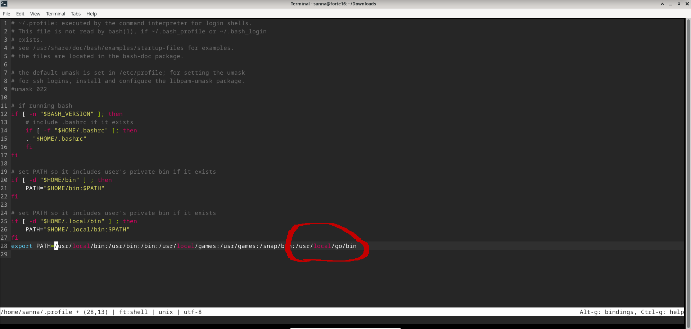
 
 Sitten taas päivitin komennolla `source $HOME/.profile`. Nyt kun katsoin echo $PATH -komennolla, niin go:n polku oli lopussa.

Seuraavaksi ohjeen https://linuxcapable.com/how-to-install-golang-go-on-debian-linux/ mukaan tein kansion gokokeilu ja sinne tiedoston hello.mod, johon kirjoitin alla kuvassa näkyvän koodin.

 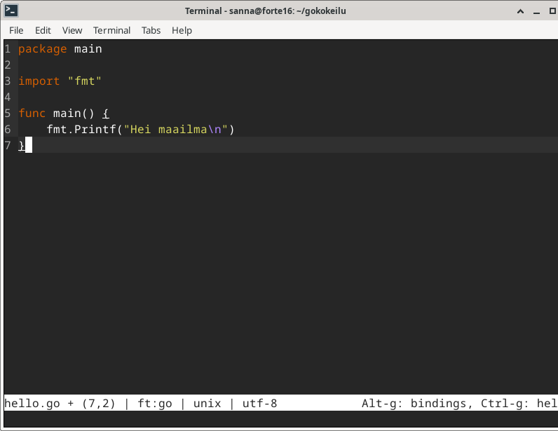

Sitten tein tiedoston go.mod johon tuli pelkästään rivi "module example.com/mod"

 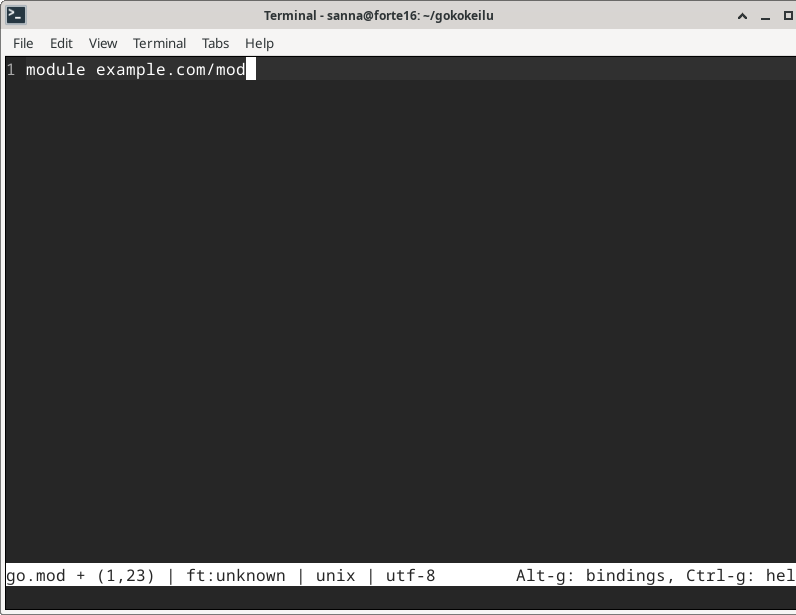

Menin gokokeilu-kansioon ja suoritin komennon go build. Muutama sekunti meni, kunnes prompt tuli takaisin. Sen jälkeen suoritin ohjelmani komennolla `./mod`

 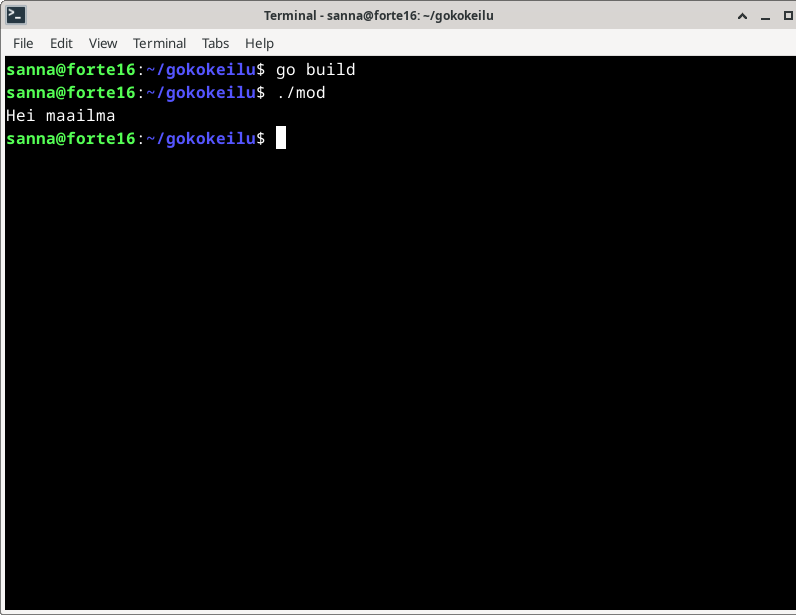

 
