## Linux-palvelimet, syksy 2024. Tehtävä h7: Maalisuora

Kurssisivut https://terokarvinen.com/linux-palvelimet/

### Laitteisto

- Prosessori i5-11H
- RAM 8,00 GB
- HDD 512 GB, tyhjää tilaa 220 GB
- Järjestelmätyyppi 64 bit
- Käyttöjärjestelmä Windows 11
- Oracle VM VirtualBox
- Debian 12

## a) Tehtävä: Kirjoita ja aja "Hei maailma" kolmella kielellä

Pyysin ChatGPT:tä suosittelemaan kolmea ohjelmointikieltä, jotka eivät ole Java (josta minulla on jo jonkin verran kokemusta) eikä Python (koska se esimerkki tehtiin jo tunnilla). ChatGPT:n ehdotukset olivat C, Ruby ja Go.

### "Hei maailma" C-kielellä
Käytetyt ohjeet: https://ost.sdsu.edu/kb/faq.php?id=152

Kirjauduin sisään Linuxiin, avasin terminal emulatorin ja suoritin komennon` which gcc`, joka näyttää mikä versio gcc-ohjelmasta ajetaan oletuksena. Jos ohjelmaa ei olisi asennettuna, niin komento ei näytä mitään. Nyt siis sain tiedon, että gcc on jo valmiina koneella.


Tein tiedoston ceeohjelma.c ja laitoin sinne ohjesivuilta ottamani esimerkkikoodin.


Ohjeessa kehotettiin kääntämään koodi komennolla `gcc [programName].c -o programName`. Muistelin, että tuntiesimerkissä ei ollut ihan tuollaista syntaksia, joten kysyin ChatGPT:ltä ovatko kaikki termit välttämättömiä. ChatGPT kertoi, että ilman ”-o programName” termiä ohjelman nimeksi tulee a.out, jonka muistinkin tuntiesimerkistä. Päätin siis käyttää "-o"-parametriä, jotta ohjelmalle tulee oma nimi.

Yrittäessäni kääntää ohjelmaa sain virheilmoituksen, koska koodista puuttui \<stdio.h\>.


Lisäsin puuttuvan koodinpätkän, käänsin ohjelman uudelleen ja ajoin sen komennolla `./ceeOhjelma`. (Olin ”fiksannut” ohjelman nimen camelcase-muotoon).


### "Hei maailma" Ruby-kielellä

Kokeilin komennolla `which ruby`, että koneella tosiaan ei ollut rubya. Sivustolta https://www.ruby-lang.org/en/documentation/installation/#apt löytyneen tiedon perusteella Rubyn voi asentaa paketinhallinan kautta komennolla `sudo apt-get install ruby-full`.


Sitten tein sivun https://www.geeksforgeeks.org/how-to-install-ruby-on-linux/ ohjeen mukaan pienen ohjelman tiedostoon "rubyOhjelma.rb", eli kirjoitin sinne `puts "Hei maailma"` ja ajoin sen ruby-komennolla. 


### "Hei maailma" Go-kielellä

Go-kielen asentaminen vaikutti vähän mutkikkaammalta kuin Rubyn. Paketinhallinnan kautta se olisi kai myös mahdollista, mutta se ei välttämättä ole kovin uusi versio(?) Löysin useita ohjeita, jotka olivat kaikki vähän erilaisia. Ensin ajattelin noudattaa DigitalOceanin sivulta löytyvää ohjetta, mutta sitten vahingossa päädyin sivun alalaitaan, jossa joku kommentoi, että ohjeissa olisi virhe. Päätin sitten yhdistellä kolmen eri sivuston ohjeita, eli tarkistaa niistä ristiin, että ne antavat samanlaisia ohjeita. Ohjesivut: https://www.digitalocean.com/community/tutorials/how-to-install-go-on-debian-10, https://phoenixnap.com/kb/debian-install-go ja https://linuxcapable.com/how-to-install-golang-go-on-debian-linux/.

Koska tein tämän kohdan eri päivänä kuin aiemmat, niin suoritin ensin komennot `sudo apt-get update` ja `sudo apt-get upgrade`. Firefox tykkäsi taas päivittyä, minkä jälkeen selain piti käynnistää uudelleen.

Päätin ladata asennustiedoston selaimella. Menin siis osoitteeseen https://go.dev/dl/ ja siellä Featured Downloads -kohdasta tallensin tiedoston osoitteesta https://go.dev/dl/go1.23.2.linux-amd64.tar.gz. Se latautui automaattisesti kansioon home/sanna/Downloads.

Sitten suoritin komennon `sudo tar -C /usr/local -xzf go1.23.2.linux-amd64.tar.gz`, joka purki arkiston kansioon /usr/local.


 Seuraavaksi asetin PATH-muuttujan tämän https://linuxcapable.com/how-to-install-golang-go-on-debian-linux/ ohjeen mukaan. 

 `echo "export PATH=/usr/local/go/bin:${PATH}" | sudo tee -a $HOME/.profile`

Näin path-muuttuja päivitettiin kyseiselle käyttäjälle.

Sen jälkeen tein komennon source $HOME/.profile, jotta path-muuttuja päivittyy heti.

 Mutta nyt kun katsoin echo-komennolla path-muttujaa, oli go siellä ensimmäisenä, eli aina kun joku komento suoritetaan, sitä etsitään ensin go-directorysta. 
 
 


Kysyin ChatGPT:ltä miten voin korjata asian. ChatGPT neuvoi muokkaamaan path-tiedostoa, joka tässä tapauksessa oli siis omassa hakemistossani oleva .profile.

Avasin tiedoston komennolla `micro ~/.profile`. Heti perään päätinkin ensin tehdä tiedostosta backupin komennolla `cp ~/.profile ~/.profile`.

Sitten muokkasin tiedostoa ja siirsin go-pathin path-rimpsun loppuun.

 
 
 Sitten taas päivitin komennolla `source $HOME/.profile`. Nyt kun katsoin echo $PATH -komennolla, niin go:n polku oli lopussa.

Seuraavaksi ohjeen https://linuxcapable.com/how-to-install-golang-go-on-debian-linux/ mukaan tein kansion gokokeilu ja sinne tiedoston hello.mod, johon kirjoitin alla kuvassa näkyvän koodin.

 

Sitten tein tiedoston go.mod johon tuli pelkästään rivi "module example.com/mod"

 

Menin gokokeilu-kansioon ja suoritin komennon go build. Muutama sekunti meni, kunnes prompt tuli takaisin. Sen jälkeen suoritin ohjelmani komennolla `./mod`

 

 ### Tehtävä: Laita Linuxiin uusi komento niin, että kaikki käyttäjät voivat ajaa sitä

 Tehtävästä oli näytetty esimerkki tunnilla, josta oli paljon hyötyä, koska mielestäni tästä oli vaikea löytää ohjeita, tai ehkä en osannut etsiä. Keskustelin myös ChatGPT:n kanssa, ja tulin siihen ymmärrykseen, että minun tulee tehdä uusi skripti, antaa sille tarvittavat oikeudet, lisätä se path-muuttujaan ja laittaa se sellaiseen paikkaan, että kaikki käyttäjät pystyvät käyttämään sitä. (Myöhemmin, siis aivan liian myöhään huomasin, että tehtävän alla oli tähän liittyvä vinkki, jonka avulla tehtävän olisi saanut suoritettua paljon helpommin. Jätän tämän version nyt kuitenkin näkyviin, niin kenties opin siitäkin jotain.)

Aloitin siis tällä ohjeella https://ryanstutorials.net/bash-scripting-tutorial/bash-script.php ja tein .sh-loppuisen skriptin (.sh-pääte oli huono idea, niin kuin myöhemmin käy ilmi).

 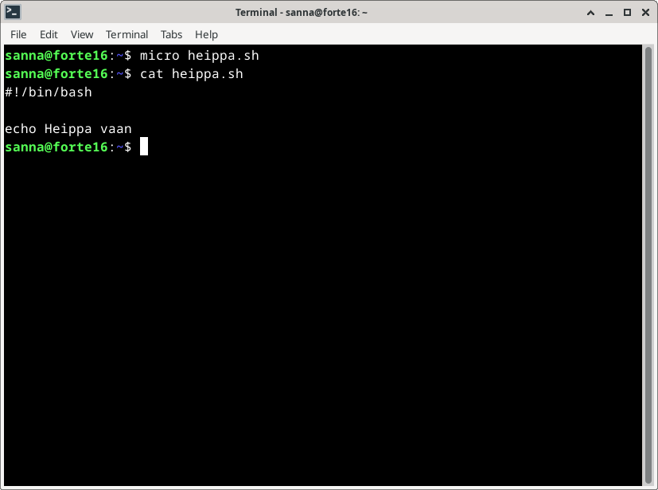

 Kun yritin suorittaa komennon `./heippa.sh`, sain virheilmoituksen "permission denied". Tämä oli odotettavissa, koska tiedostolla ei ollut suoritus-oikeuksia.

  Käyttämäni ohjeen mukaan annoin tiedostolle "755"-oikeudet, joiden päättelin olevan sama kuin jos olisin lisännyt tiedostolle oikeudet "ugo+x" eli kaikille suoritus-oikeudet (edellisten oikeuksien lisäksi). `ls -l` -komennoilla näin, että tiedoston oikeudet olivat muuttuneet. Nyt pystyin ajamaan ohjelman komennolla ./heippa.sh tai bash ./heippa.sh

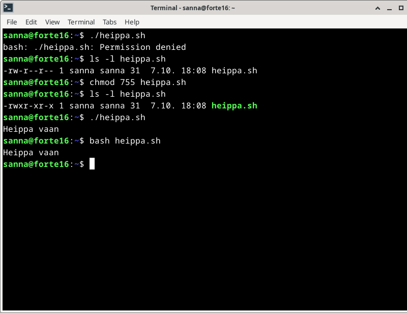

Seuraavaksi kopioin .sh-tiedoston kansioon /usr/local/bin. Siihen tarvittiin sudo-oikeuksia.

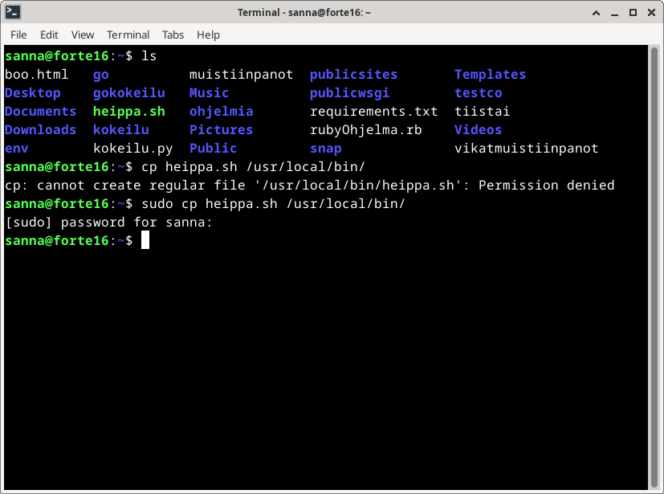

Halusin nyt kokeilla, että toimisiko komento jollakin toisella käyttäjällä, eli loin uuden käyttäjän komennolla `sudo adduser koe` ja vaihdoin sen käyttäjäksi.

Kun yritin ajaa heippa.sh-komentoa uudella käyttäjällä, sain virheilmoituksen "No such file or directory".

En myöskään omalla käyttäjätunnuksella pystynyt suorittamaan sitä, ellen ollut siinä kansiossa, jossa .sh-tiedosto oli.

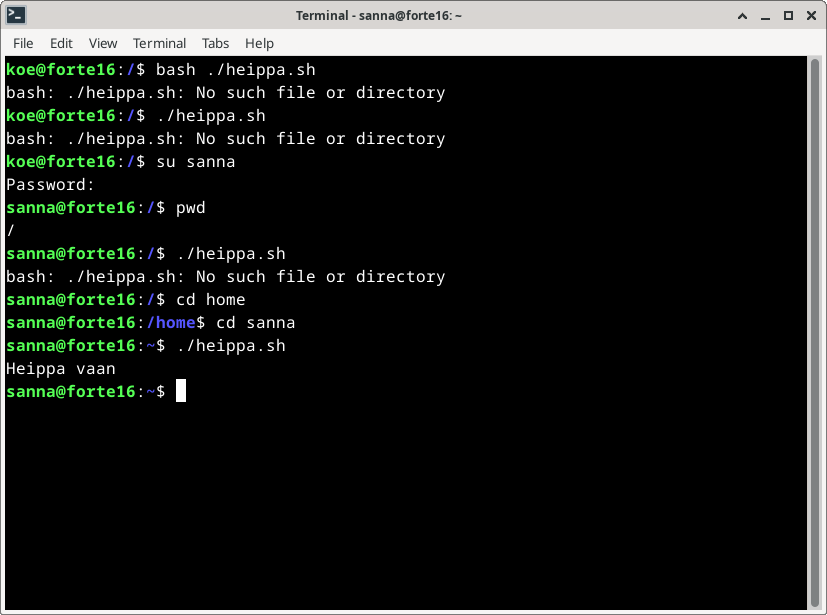

Kysyin ChatGPT:ltä ja sen neuvojen mukaan ajoin komennon `source ~/.bashrc` ja tarkistin myös, että suoritusoikeudet edelleen olivat niin kuin pitkin. Source-komento ei auttanut, eikä myöskään `hash -r`, jota ChatGPT myös suositteli (ehkä pitäisi aina tsekata, mitä ne GPT:n keksimät komennot oikeasti tekevät...)

Kun menin kotihakemistooni, jossa alkuperäinen heippa.sh oli ja suoritin siellä `which heippa.sh`, niin se näytti /usr/local/bin, eli sieltähän sen pitäisikin tulla, mutta miksi se ei toimi muualla.

Deletoin kotihakemistossani olleen heippa.sh-tiedoston ja sen jälkeen sainkin taas tutun valituksen "no such file or directory". 

ChatGPT neuvoi tarkistamaan koodin ja hakemistot ja oikeudet. Kaikki vaikutti olevan kunnossa. Sitten muistin vanhan viisauden eli uudelleenkäynnistämisen. Kirjauduin Linuxista ulos ja takaisin sisään, ja nyt komento toimi sekä omalla että uudella käyttäjällä.

Kysyin vielä ChatGPT:ltä, että miten komennon saa toimimaan ilman .sh-päätettä, ja ohjeen mukaan yksinkertaisesti siirsin tiedoston päätteettömään versioon siellä /usr/local/bin-hakemistossa: `sudo mv heippa.sh heippa`. Sen jälkeen kokeilin vielä, että "heippa" toimii myös muissa kansioissa ja toisella käyttäjällä.

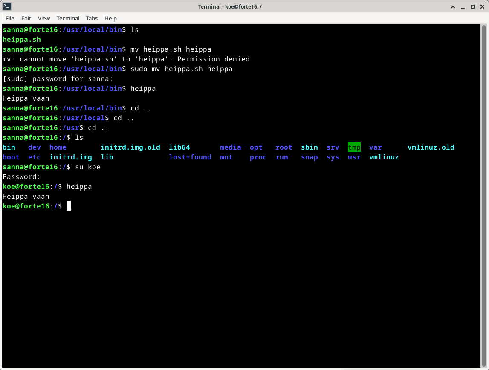

### Ratkaise vanha arvioitava laboratorioharjoitus soveltuvin osin

Aloitus 13:05

Harjoitusta varten asensin uuden Linux-imagen Virtual Boxiin. Imagen versionumero oli vaihtunut, mutta muuten sen asennus meni aika lailla samalla lailla kuin aikaisemmassa asennuksessa. Suoritin update- ja dist-upgrade-komennot ja lisäksi asensin palomuurin ja laitoin sen päälle. Asensin myös micro-editorin, jotta voin kirjoittaa sillä raporttia.

Valitsin labraharjoitukseksi viime kevään kurssin eli https://terokarvinen.com/2024/arvioitava-laboratorioharjoitus-2024-linux-palvelimet/

_c) Ei kolmea sekoseiskaa. Suojaa raportti Linux-oikeuksilla niin, että vain oma käyttäjäsi pystyy katselemaan raporttia_

  ls -l komennosta näin, että "raporttini" eli vanhalabra-dokumentin oikeudet olivat _-rw-r--r--_. 
  
  
 
  
Se pitäisi siis muuttaa muotoon _-rw-------_, eli niin että vain minulla on oikeudet lukea ja kirjoittaa siihen. Yritin ensin käskyä "chmod go -r vanhalabra", jolla sain aikaiseksi virheilmoituksen, koska järjestelmä ei ymmärtänyt mikä "go" on, ja koska olin sen perään jättänyt välin ja laittanut "-r", niin komento poisti lukuoikeudet kaikilta eli myös itseltäni. Olin siis muistanut komennon väärin. Lisäsin itselleni oikeudet takaisin komennolla "chmod u+wr vanhalabra", ja nyt tiedostolla oli halutut oikeudet.

 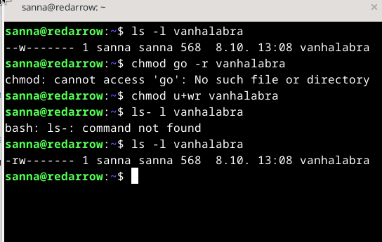

_d) 'howdy': Tee kaikkien käyttäjien käyttöön komento 'howdy'. Tulosta haluamaasi ajankohtaista tietoa, esim päivämäärä, koneen osoite tms. Pelkkä "hei maailma" ei riitä. Komennon tulee toimia kaikilla käyttäjillä työhakemistosta riippumatta_

Koska olin juuri tehnyt tämän, niin tämänhän pitäisi mennä heittämällä. (Jos ei lasketa sitä, että nimesin komennon väärin...)

Aikomuksenani oli siis tehdä pieni skripti, jonka pitää tulostaa päivämäärä (se piti selvittää) ja lopuksi komennon piti olla kaikkien
saatavilla riippumatta siitä, missä hakemistossa käyttäjä komentoa käyttää.

Pikaisesti googlasin, että Debianissa voi tulostaa päivämäärän komennolla "date".

Tein alla näkyvän tiedoston

 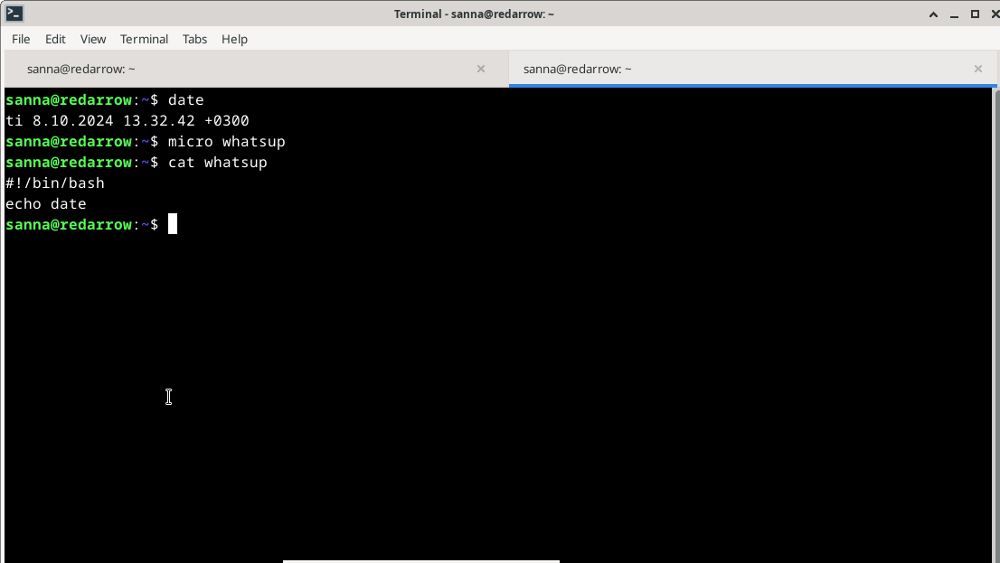

Annoin sitten kaikille tiedostoon suoritusoikeudet eli `chmod ugo+x whatsup`. Jossain vaiheessa tuli mieleen, että kannattaako komentoja antaa others-ryhmän käyttöön, mutta jos se tulostaa vain päivämäärän, niin ehkä se ei ole vaarallinen.

Kun yritin suorittaa komennon, sain tulokseksi vain "date". Sitten googlasin, miten se oikeasti tehdään ja sivun https://www.squash.io/formatting-and-displaying-dates-with-bash-scripts-in-linux/ ohjeilla muokkasin komentotiedostoa:

```
#!/bin/bash

current_date=$(date +"%Y-%m-%d")
echo "Current date: $current_date"
```

Lopuksi muokkasin sitä vielä niin, että se näyttää päivämäärän suomalaisessa muodossa.

Siirsin tiedoston kansioon /usr/local/bin komennolla `sudo mv whatsup /usr/local/bin`.

Sitten tein uuden käyttäjän ja menin kyseisen käyttäjän kotihakemistoon ja suoritin siellä whatsup-komennon. Komento siis toimi myös toisella käyttäjällä eikä hakemistolla ollut väliä.

 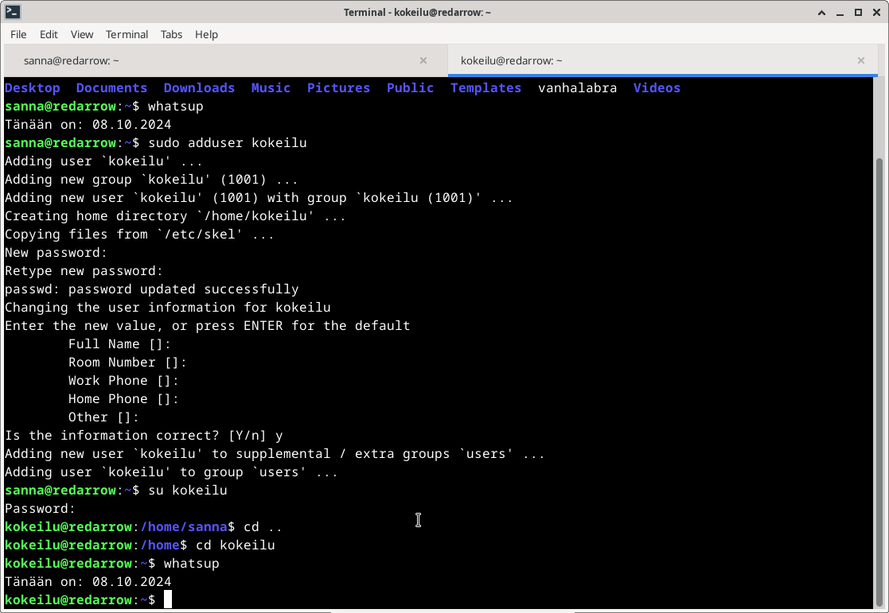

_e) Etusivu uusiksi: Asenna Apache-weppipalvelin. Tee yrityksellemme "AI Kakone" kotisivu. Kotisivu tulee näkyä koneesi IP-osoitteella suoraan etusivulla. Sivua pitää päästä muokkaamaan normaalin käyttäjän oikeuksin (ilman sudoa). Liitä raporttiisi listaus tarvittavien tiedostojen ja kansioiden oikeuksista._

Eli pitäisi asentaa Apache ja laittaa näkymään nettisivu, joka näkyy suoraan etusivulla. Ymmärrän tämän niin, että sen pitää näkyä osoitteessa 127.0.0.1. Ja sitä pitää pystyä muokkaamaan ilman sudo-oikeuksia.

Asensin apachen komennolla `sudo apt-get -y install apache2`. Sitten tein virtualhostille config-tiedoston: `sudoedit /etc/apache2/sites-available/aikakone.example.com.conf`. Sen jälkeen tein komennot `sudo a2ensite aikakone.example.com` ja `sudo systemctl restart apache2`.

 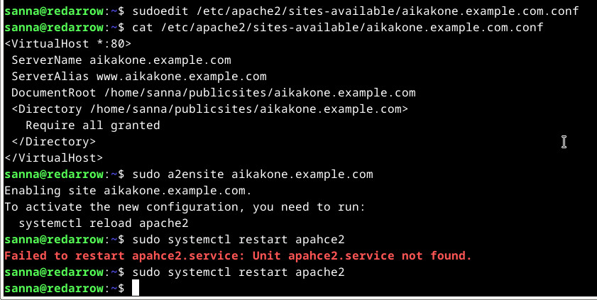

Jälkikäteen ajateltuna tämä vaihe oli turha, sillä tein sivua publicsites-kansioon, joka ei ole järkevää, jos halutaan että nettisivuja voivat muokata muutkin. Jätän tämän kuitenkin raporttiin. Eli tein kansion komennolla `mkdir -p /home/sanna/publicsites/aikakkone.example.com/` ja kirjoitin index-sivulle "aikakone" komennolla `echo aikakone > /home/sanna/publicsites/aikakone.example.com/index.html`. Kun nyt menin sivulle "aikakone.example.com" niin sain virheilmoituksen "Server not found". Localhostista tuli Apachen oletussivu (niin kuin oletinkin, koska en ollut tehnyt sille mitään.) Curl-komento `curl -H 'Host: aikakone.example.com' localhost` sen sijaan toimi, eli sieltä tulostui "aikakone".

Kävin katsomassa toisen opiskelijan vanhasta raportista https://github.com/jennimuhonen/linux-kurssi/blob/main/h3-hello-web-server.md, että hosts-tiedostoon pitäisi lisätä `127.0.0.1 aikakone.example.com.` Tein vielä komennon `sudo systemctl restart apache2` ja nyt sivu alkoi toimia myös selaimessa.

Mutta sivun pitäisi näkyä etusivulla, ja sitä pitäisi kenen tahansa pystyä muokkaamaan. Aikakoneen sivu oli nyt omassa kotihakemistossani, eli sen olisi parempi olla jossain "yleisissä tiloissa". 

Hakeuduin kansioon "var/www/html/", jossa oli Apachen oletussivun index.html

 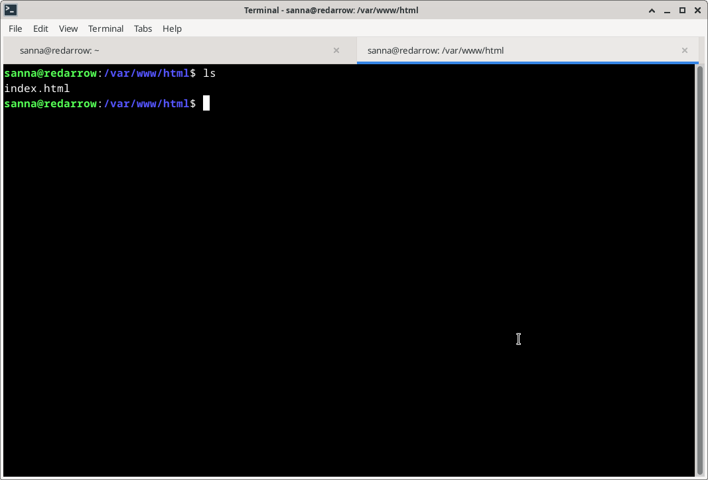

 Annoin aluksi index.html-sivulle oikeudet ugo+w, eli kaikilla on oikeudet myös muokata tiedostoa, mutta myöhemmin poistin sen "others"-ryhmältä, koska se ei ehkä ole hyvä idea. Index-sivulle jäi siis oikeudet _-rw-rw-r--_. Aluksi en koskenut kansioiden oikeuksiin ja pystyin siis kirjoittamaan index.html-sivulle ilman sudo-oikeuksia. Mutta myöhemmin kun sitä kokeilin, en pystynytkään muokkaamaan sivua ilman sudoa.

 Yritin etsiä tietoa netistä mutta lopulta käännyin ChatGPT:n puoleen, ja sen neuvojen perusteella vaihdoin html-kansiolle omistajaksi sannan ja groupiksi "users". Kansion oikeuksi tuli sellaiset, että kaikilla muilla on kaikki oikeudet, paitsi "others"-ryhmällä ei ole kirjoitusoikeuksia. Nyt pystyin kokeilu-nimisellä käyttäjällä muokkaamaan index.html-sivua.

 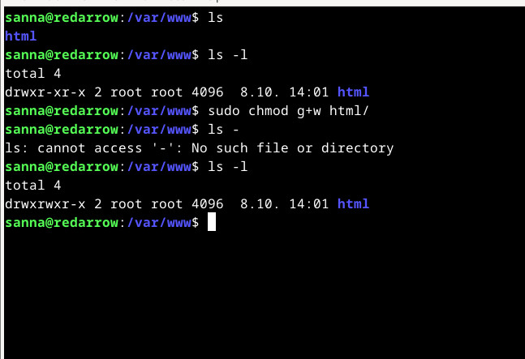

  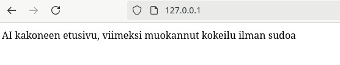

  Lopetus klo 15:00 (ei sisällä viimeisimmän tehtävän ryhmän muutosta). Enempiä tehtäviä en ehtinyt tehdä.
