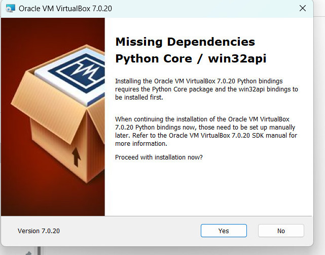
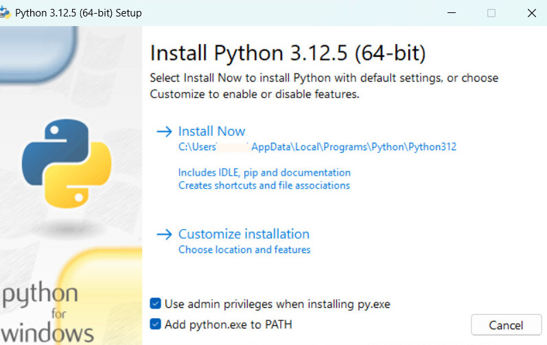
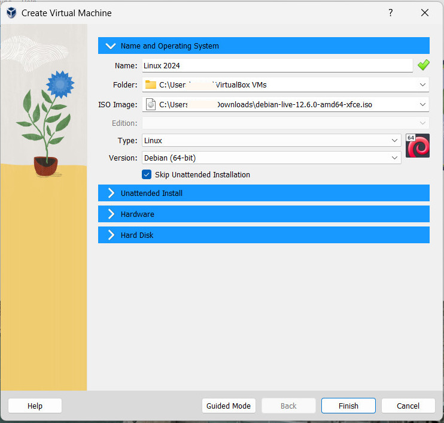
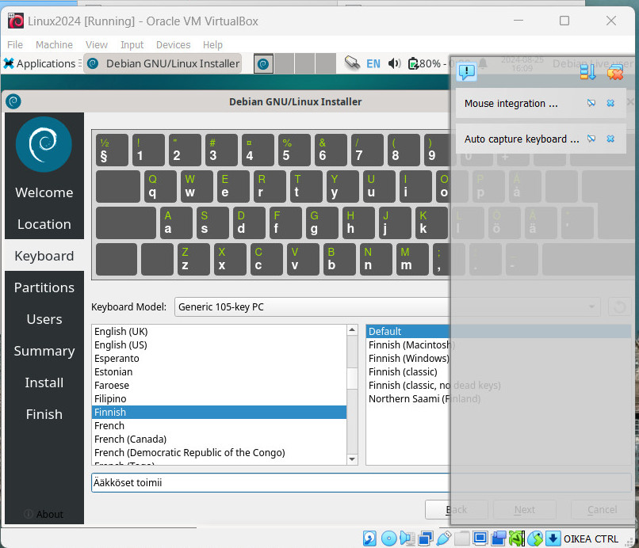
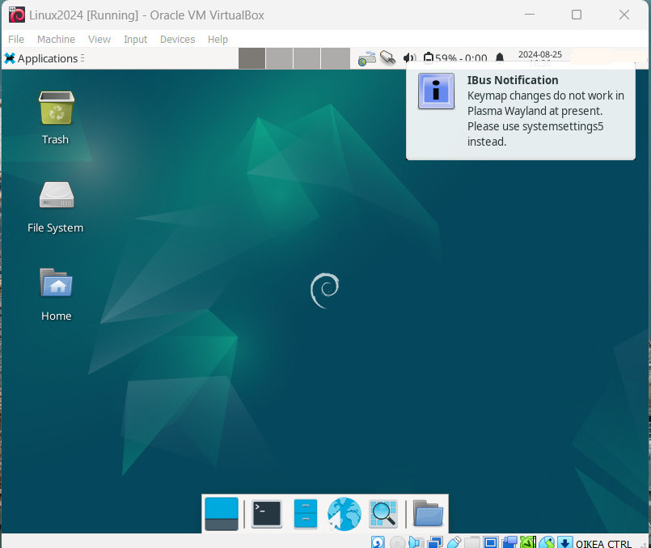
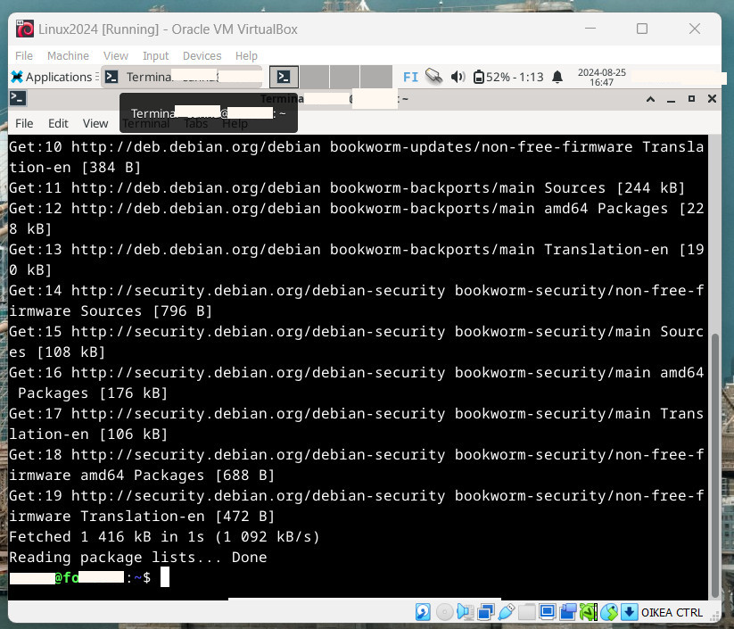
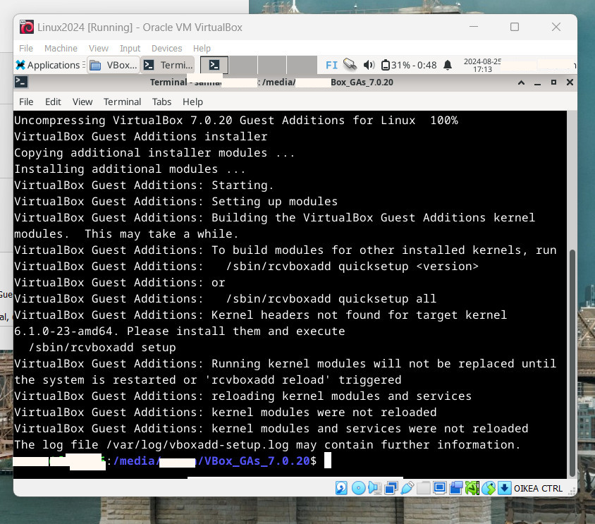

# Linux-palvelimet
## Tehtävä h1

### Tiivistelmä tekstistä Raportin kirjoittaminen, Karvinen, Tero, 6.6.2006 https://terokarvinen.com/2006/raportin-kirjoittaminen-4/ 
-	Miksi kirjoittaa raportti? Asiat muistiin ja samalla ajatukset selkenevät.
-	Toistettavuus: jonkun toisen tekemänä pitää tulla sama tulos, muista raportoida myös laitteisto.
-	Täsmällisyys: mitä teit ja milloin, mitä sitten tapahtui tai ei tapahtunut. Mistä tiedät mitä tapahtui? Raportoi tarvittaessa eteenpäin laitteistosta tai ohjelmiston vioista.
-	Helppolukuisuus: Käytä väliotsikoita ja huolellista kieltä. Raportin alkuun voit lisätä lyhyen tiivistelmän.
-	Viittaa lähteisiin ja lisää halutessasi lisenssi. Älä sepitä, plagioi tai käydä muiden kuvia luvatta.

### Tiivistelmä tekstistä What is Free Software?  https://www.gnu.org/philosophy/free-sw.html
-	Free software eli vapaa ohjelmisto tarkoittaa, että kuka tahansa voi käyttää, muokata, tutkia ja jakaa ohjelmistoa. 
-	Neljä tärkeää vapautta:
•	Vapaus käyttää (ajaa) ohjelmaa mihin tarkoitukseen vaan.
•	Vapaus tutkia ja muuttaa ohjelman toimintaa haluamallasi tavalla. Lähdekoodin täytyy siis olla saavutettavissa.
•	Vapaus jakaa ohjelman kopioita muille.
•	Vapaus jakaa tekemiäsi muutoksia muille, jotta he voivat hyötyä muutoksista. 
-	Vapaa ohjelmisto eroaa vapaan lähdekoodin ohjelmistoista. Vapaa ohjelmisto on eettinen näkökulma siitä, että ohjelmistojen tulisi olla vapaita kaikkien käytettäviksi.
-	Vapaita ohjelmistoja voi käyttää kaupallisessa tarkoituksessa, esimerkiksi tarjoamalla niille tukipalveluja.

# Virtual Boxin ja Linuxin asennus

## Laitteisto
- Asus TUF Gaming -kannettava
- RAM 8,00 GB
- HDD 512 GB
- Prosessori i5-11H
- Järjestelmätyyppi 64 bit
- Käyttöjärjestelmä Windows 11

## Virtual Boxin asennus

Klo 13:50  
Latasin Debian Iso imagen, tiedosto debian-live-12.6.0-amd64-xfce.iso 
<a href="https://cdimage.debian.org/debian-cd/current-live/amd64/iso-hybrid/">Debian-sivulta</a> (n. 3 GB).

Sen jälkeen latasin Virtual Boxin sivulta <a href="https://cdimage.debian.org/debian-cd/current-live/amd64/iso-hybrid">Virtualbox.org</a> 
kohdasta "VirtualBox 7.0.20 platform packages-Windows hosts" (n. 100 MB).

Suoritin ladatun .exe-tiedoston ja klikkasin kolmeen ensimmäiseen kohtaan "next".

### Python core puuttuu
Tässä kohtaa tuli ilmoitus, että koneesta puuttui Python core/win32api.
 

Keskeytin asennuksen, ja Duckduckgo-haualla löysin sivun  <a href="https://www.sysnettechsolutions.com/en/fix-python-win32api-virtualbox/">https://www.sysnettechsolutions.com/en/fix-python-win32api-virtualbox/</a>, jonka ohjeiden perusteella latasin <a href="https://www.python.org/downloads/">Python.org-sivustolta</a> tiedoston "python-3.12.5-amd64.exe". Suoritin sen admin-oikeuksilla ja klikkasin boksit "use admin privileges when installing py.exe" sekä "add python to Path".

 
klo 14:16  
Sivuston ohjeen mukaan avasin Powershellin admin-oikeuksilla. (Tässä vaiheessa varmistin ChatGPT:ltä, että sivuston antama komento ei ainakaan tee mitään pahaa.) Suoritin komennon “py -m pip install pywin32”. (En nähnyt sivustolla mainittua pip-päivitystä, joten en tehnyt siihen liittyvää kohtaa.)

### Asennus alusta
Klo 14:22  
Aloitin siis Virtual Boxin asennuksen uudelleen. Taas klikkasin kaksi kertaa next, varoituksesta next, Custom Setup-kohdast jätin kaikki valituiksi (Create start menu entries etc). Sen Jälkeen "Click installation". Tämän jälkeen klikkasin Finish.

## Linuxin asennus
(Tauko 14:30-15:30)
Klo 15:30  
Avasin Virtual Boxin ja valitsin Machine...new, Create virtual Machine, expert mode

Lisäsin nimen ja hain ISO-imagen kansiosta, johon sen olin ladannut. Type-kohtaan laitoin Linux ja version-kohtaan Debian (64 bit), ja  klikkasin boksin "Skip unattended installation".
 
 
HUOM, jos tässä kohtaa ei jo laittanut ISO-imagea, niin kohta "Skip unattended Installation" oli harmaa, eikä sitä siis voinut valita. 

Kohdasta hardware: laitoin 2048MB, en klikannut kohtaa "Enable EFI (special OSes only), Hard disk: Create a Virtual Hard Disk Now, Hard Disk Size: 60,00 GB, Hard Disk Type and Variant (default eli VDI (Virtual Box Image).

Toisin kuin kurssiohjeessa, tässä ei ollut valintaa "Dynamically allocated" vaan "Pre-allocate Full Size", jota en valinnut. Sitten Finish.

Klo 15:55  
(Ohjeissa tämän jälkeen tulisi lisätä ISO Virtual Box kohdassa Settings, Storage ja Controller:IDn-alle, mutta olin siis jo lisännyt sen aiemmassa vaiheessa.)

Tuplaklikkasin Linux2024-kuvaketta Virtual Boxissa. Ilmestyi ikkuna "Debian 12", josta valitsin ensimmäisen eli Live.

Ruutu meni hetkeksi mustaksi, ja sitten Desktop tuli näkyviin. Desktopin oikeaan yläkulmaan tuli pari huomautusruutua, mutta en ehtinyt reagoida niihin, ennen kuin ne katosivat.

Klo 16:03  
Ylävasemmalta "Applications"-kohdasta avasin Web Browserin ja kokeilin, että netti toimii.

16:07  
Klikkasin ikonia Install Debian. Tuli varoitus, ja klikkasin "Run anyway". Asetin kieli- ja aikavyöhykeasetukset: language: default, American English, 
Aikavyöhyke-kartasta valitsin Europe/Helsinki. Keyboard Model: default eli Generic 105-key PC, joka oli vähän erilainen kuin ohjeessa, joissa oli lisäksi (intl.)
Vasemmalta valikosta otin Finnish ja oikeaan valikkoon jätin Default.
 

(Tässä kohtaa Core Temp -ohjelma valitti, että yksi tai kaksi prosessoria ylittivät itseni laittamat varoituslämpötilat, joten irrotin virtapiuhan koneesta.)

Klo 16:15  
Seuraavasta ikkunasta valitsin Erase disk ja jätin Boot loader location defaultiin eli Master Boot record of VBOX Harddisk. Sitten lisäsin nimeni, login-nimen ja koneen nimen sekä salasanan. "Log in without password" -kohtaan "no" ja sitten klikkasin "install".

Klo 16:34  
Installoimiseen meni noin kymmenen minuuttia. Valitsin uudelleenkäynnistämisen ja "Done".
Aluksi tuli hämäävästi Debian-desktop, mutta jonkin ajan päästä näkyy login-ikkuna.

Klo 16:39  
Tässä kohtaa tuli ilmoitus: "Ibus Notification. Keymap changes do not work in Plasma Wayland at present. Please use systemsettings5 instead."
Googlasin ja löysin keskustelun <a href="https://lists.debian.org/debian-input-method/2024/02/msg00040.html">Debian.org-sivustolta</a>, jonka perusteella päätin jättää välittämättä ilmoituksesta.

 
 
Klo 16:45  
Avasin nettiselaimen ja tarkistin, että netti toimii.

Avasin Terminal Emulatorin ja kirjoitin "sudo apt-get update", minkä jälkeen laitoin salasanan. Se lataili kaikenlaista. Kirjoitin "sudo apt-get -y dist-upgrade", jolloin kone latasi lisää tavaraa. Sen jälkeen pyydettiin salasanaa, jonka jälkeen kone asenteli joitakin setuppeja ehkä noin minuutin ajan.

Asensin palomuurin komennolla "sudo apt-get -y install uf"'ja "sudo ufw enable", minkä jälkeen näkyi teksti "Firewall is active and enabled on system startup"
 

Klo 17:00  
Kohdasta Appplications valitsin logout ja restart (poistin ruksin kohdasta Save session for future logins). Uudelleenkäynnistys sujui normaalisti.

### VirtualBox Guest Additions 
Klo 17:05  
Työpöydän saamiseksi isommaksi tein seuraavaa. Virtual Boxin kohdasta "Devices" valitsin "Insert Guest Additions CD image", ja se ilmestyi Debianin desktoppiin. Debianin kohdasta Applications, File manager ja sieltä Devices-kohdassa etsin desktopista kyseisen.

Klo 17:11  
Avasin Terminator emulatorin ja kirjoitin "cd /media/*/Vbox* ja sitten ls. Kun olin oikeassa kansiossa, kirjoitin "sudo bash VBoxLinuxAdditions.run". Jotain alkoi tapahtua. Sitten tuli ilmoitus "Kernel headers not found for target kernel 6.1.0-23-amd64 please install them and execute." Työpöytä oli kuitenkin muuttunut isoksi.
 
 
klo 17:20  
Uudelleenkäynnistys ja lopetus.

### Lähteet
- Karvinen, Tero, Install Debian on Virtualbox - updated 2023 https://terokarvinen.com/2021/install-debian-on-virtualbox/
- Debian.org, sähköpostilista https://lists.debian.org/debian-input-method/2024/02/msg00040.html
- Bagci, Tolca, 22.7.2024, How to Fix Missing Dependencies Python Core / win32api in VirtualBox https://www.sysnettechsolutions.com/en/fix-python-win32api-virtualbox/

